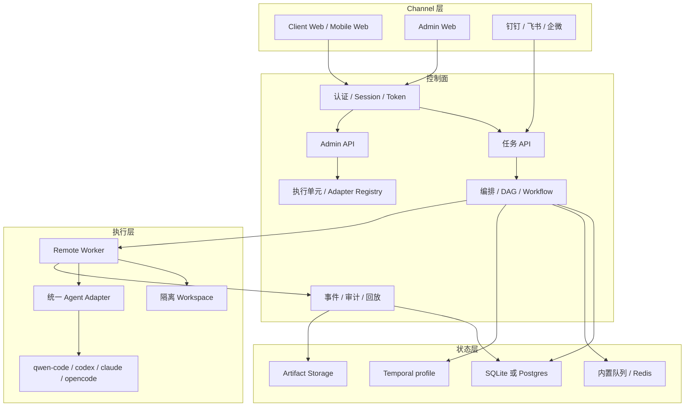
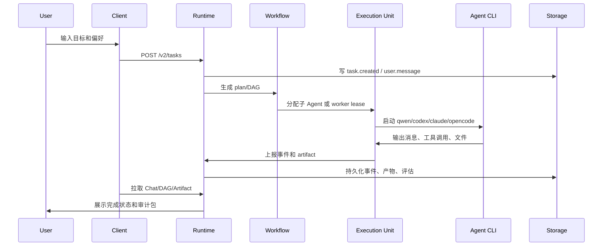
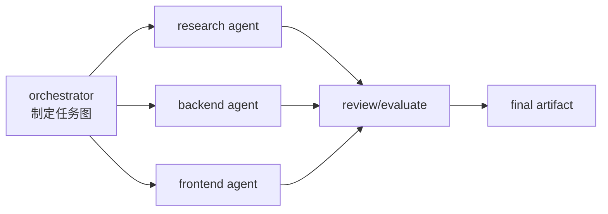
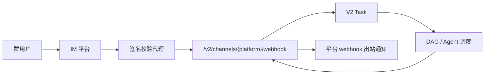

# 架构走读：从部署到一次任务完成

这篇文档把 AgentFlow 的黑盒拆开，按“用户发起任务到产物落盘”的链路解释每一层。它不是设计愿景，而是当前 V2 产品和部署形态的实现地图。

## 1. 分层总览



## 2. Client 和 Admin 的边界

| 端 | 面向谁 | 主要能力 |
| --- | --- | --- |
| Client | 普通用户、移动端用户、任务发起者 | 登录、快速创建任务、查看 Chat/DAG/产物/重试 |
| Admin | 运维、平台管理员、租户管理员 | 执行单元、Channel、租户、RBAC、HA、Workflow、审计 |

路由入口：

```text
/#/
/#/tasks/:taskId
/#/admin
```

不再暴露单独的 V1/V2 产品入口。后端 API 仍保留 `/v2/...` 命名，用来区分新控制面接口和历史运行时接口。

## 3. 一次任务如何流动



关键持久化点：

| 阶段 | 持久化内容 |
| --- | --- |
| 创建 | task、输入、source、tenant、channel |
| 计划 | DAG、子任务、profile、目标和依赖 |
| 执行 | agent message、tool call、状态、错误 |
| 产物 | artifact index、文件、manifest |
| 评估 | 子任务结果、自动评估、重试策略 |
| 回放 | 原始事件流和 replay projection |

客户端崩溃不会影响后台任务，浏览器重新登录后会从控制面读取任务状态和事件。

## 4. 多 Agent 编排

复杂任务会先进入编排层，由 orchestrator 生成：

| 对象 | 含义 |
| --- | --- |
| plan | 总体拆解和执行策略 |
| DAG | 子任务节点、依赖关系、并行/串行策略 |
| profile | 子 Agent 角色、adapter、工具权限、资源限制 |
| artifact contract | 每个子任务必须交付什么 |
| evaluation | 如何判断产物是否合格 |

简化 DAG 示例：



当前 runtime 有轻量 durable workflow profile 和 Temporal/HA 部署预留。单机模式先用内置队列跑通，生产 profile 用 Postgres、Redis 和 Temporal 承担更强的恢复、重试和水平扩展。

## 5. Adapter 协议

所有真实 Agent CLI 通过统一 adapter 接入：

| adapter | 典型命令 | 说明 |
| --- | --- | --- |
| `fake` | 内置 | smoke test 和链路验证 |
| `qwen` | `qwen` | qwen-code |
| `codex` | `codex` | Codex CLI |
| `claude` | `claude` | Claude Code |
| `opencode` | `opencode` | OpenCode |

统一协议关注：

| 维度 | 要求 |
| --- | --- |
| 输入 | goal、上下文、workspace、权限策略 |
| 输出 | message、tool call、artifact、exit status |
| 控制 | cancel、timeout、retry、permission decision |
| 审计 | 原始日志、标准化事件、错误分类 |
| 隔离 | per-run workspace、资源限制、secret 注入边界 |

## 6. Channel 如何进入系统



Channel 层不直接绕过权限和审计。每条入站消息都会记录 channel message，并带着 `source=platform` 创建任务；每条出站消息也会记录状态，便于复盘。

## 7. 多租户和 RBAC

Admin 端管理：

| 对象 | 用途 |
| --- | --- |
| Tenant | 租户基础配置和默认策略 |
| User | 租户内用户 |
| RBAC policy | 角色、权限、资源范围 |
| Channel mapping | 群、机器人、租户映射 |
| Execution policy | 租户可用 adapter、执行单元、资源上限 |

当前自托管默认以单租户 owner 起步，Admin 已提供租户、用户、RBAC 配置面。生产接入企业 SSO、邮箱验证和更细粒度租户隔离时，应把租户 id 从登录态、Channel 代理或 API token 中显式传入。

## 8. HA 设计边界

| 层 | 单机 profile | HA profile |
| --- | --- | --- |
| Runtime | 单进程 | 可多实例，前面加反向代理 |
| DB | SQLite | Postgres |
| Queue | 内置队列 | Redis |
| Workflow | 内置 durable engine | Temporal profile |
| Worker | 本机或远程 worker | 多 worker 副本 |
| Artifact | 本地目录 | 共享卷、NAS 或对象存储 |
| Backup | 文件/目录备份 | DB dump、卷快照、artifact 备份 |

2C2G 的正确定位通常是公网边缘或单 worker，不是完整 HA 节点。HA profile 应部署在资源更稳定的 NAS、工作站或更大云主机上。

## 9. 审计和回放

审计闭环包括：

| 能力 | 说明 |
| --- | --- |
| event sourcing | 任务状态由事件流重建 |
| raw logs | 保留 CLI 输出和错误 |
| artifact manifest | 记录每个产物的名称、大小、路径 |
| replay | 用历史输入和事件投影复盘 |
| retry | 失败后基于策略和上下文重试 |
| evaluation | 子任务和最终产物都有评估结果 |

用户侧看到的是 Chat、DAG、产物和重试；Admin 侧看到的是事件、worker、Channel message、租户配置和 HA 状态。

## 10. 从部署到使用的推荐路径

1. 按 [完整部署教程](deployment-runbook.md) 部署 Runtime。
2. 用 owner 账号登录 Client 和 Admin。
3. 跑 V2 smoke。
4. 注册一台执行单元。
5. 注册一台 remote worker。
6. 先跑 fake task。
7. 再启用真实 qwen/codex/claude/opencode adapter。
8. 接入一个 IM Channel。
9. 做一次完整任务，下载 artifact 和 audit bundle。
10. 配置备份和监控。

