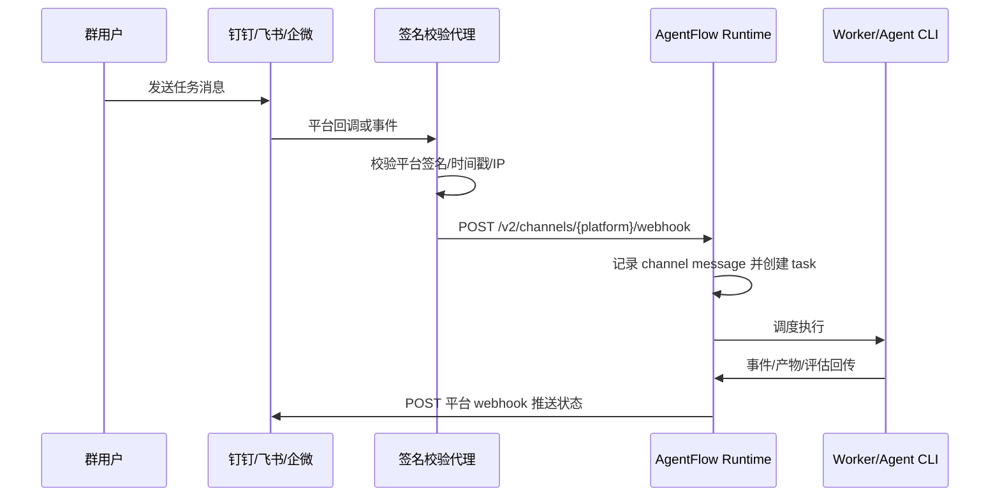
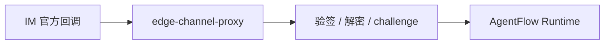

# 钉钉、飞书、企业微信机器人接入

AgentFlow 的 Channel 设计把 Web、移动端 Web、钉钉、飞书、企业微信都抽象成统一入口：入站消息可以创建任务，出站消息可以推送任务状态。Runtime 负责统一留痕、审计和任务创建；各 IM 平台的原生签名、IP 白名单、加签发送建议由边缘代理处理。

官方平台文档建议先读：

| 平台 | 官方文档 |
| --- | --- |
| 飞书 | [自定义机器人使用指南](https://open.feishu.cn/document/client-docs/bot-v3/add-custom-bot?lang=zh-CN) |
| 钉钉 | [自定义机器人接入](https://open.dingtalk.com/document/app/custom-robot-access) |
| 企业微信 | [群机器人官方文档](https://developer.work.weixin.qq.com/document/path/91770) |

## 1. AgentFlow Channel 模型



Runtime 当前支持：

| 能力 | 路径 | 说明 |
| --- | --- | --- |
| 配置 Channel | `POST /v2/admin/channels/{platform}/config` | 保存 webhook、callback token 等配置 |
| 出站消息 | `POST /v2/admin/channels/{platform}/send` | 向平台机器人 webhook 发送文本消息 |
| 入站消息 | `POST /v2/channels/{platform}/webhook` | 接收群消息并创建 AgentFlow 任务 |
| 消息审计 | `GET /v2/admin/channel-messages` | 查看最近入站/出站消息 |

支持的平台名：

```text
web, mobile, dingtalk, feishu, wecom
```

安全边界要说清楚：AgentFlow 内置的是统一 `callback_token` 校验，不等同于每个平台的原生签名校验。生产环境建议部署边缘代理，由代理验证飞书、钉钉、企业微信的官方签名或安全策略，再转发给 Runtime，并带上 `x-agentflow-channel-token`。

## 2. 在 Admin UI 配置

1. 打开 Admin -> Channels。
2. 选择 `feishu`、`dingtalk` 或 `wecom`。
3. 填入平台给你的 `webhook_url`。
4. 设置一个随机 `callback_token`，用于入站回调保护。
5. 保存配置。
6. 点击发送测试消息。
7. 打开 Channel Messages，确认出站状态为 `sent`。

如果测试消息失败，先看平台机器人安全设置。飞书、钉钉、企业微信都可能启用关键词、IP 白名单、签名或频控策略；这些配置会影响 webhook 是否接受 AgentFlow 的出站请求。

## 3. API 配置示例

下面以飞书为例，钉钉和企微只需要把路径中的 `feishu` 改成 `dingtalk` 或 `wecom`。

```bash
export BASE_URL=http://127.0.0.1:8765
export RUN_MANAGER_TOKEN=replace-with-runtime-token
export CHANNEL_TOKEN=replace-with-random-callback-token

curl -X POST "$BASE_URL/v2/admin/channels/feishu/config" \
  -H "Authorization: Bearer $RUN_MANAGER_TOKEN" \
  -H "Content-Type: application/json" \
  -d '{
    "webhook_url": "https://open.feishu.cn/open-apis/bot/v2/hook/replace-me",
    "callback_token": "'"$CHANNEL_TOKEN"'"
  }'

curl -X POST "$BASE_URL/v2/admin/channels/feishu/send" \
  -H "Authorization: Bearer $RUN_MANAGER_TOKEN" \
  -H "Content-Type: application/json" \
  -d '{"message":"AgentFlow channel test"}'
```

入站测试：

```bash
curl -X POST "$BASE_URL/v2/channels/feishu/webhook" \
  -H "x-agentflow-channel-token: $CHANNEL_TOKEN" \
  -H "Content-Type: application/json" \
  -d '{
    "event": {
      "sender": {"sender_id": {"open_id": "ou_test"}},
      "message": {
        "message_id": "msg_test_001",
        "content": "{\"text\":\"请生成一次本周运维巡检报告\"}"
      }
    }
  }'
```

返回 `accepted: true` 时，AgentFlow 会创建一条来源为 `feishu` 的任务，并在任务 metadata 中保留原始 channel payload。

## 4. 飞书接入

### 4.1 创建机器人

1. 在飞书群聊中进入群设置。
2. 添加自定义机器人。
3. 复制 webhook URL。
4. 如启用了关键词，确保 AgentFlow 出站文本包含关键词，或关闭关键词限制。
5. 如启用了签名或 IP 白名单，建议使用边缘代理处理。

AgentFlow 直接出站文本 payload：

```json
{
  "msg_type": "text",
  "content": {
    "text": "AgentFlow message"
  }
}
```

### 4.2 入站消息

AgentFlow 接受的飞书入站样例：

```json
{
  "event": {
    "sender": {"sender_id": {"open_id": "ou_1"}},
    "message": {
      "message_id": "msg_1",
      "content": "{\"text\":\"Create a weekly ops report\"}"
    }
  }
}
```

如果你用飞书应用机器人接收事件，请在飞书开放平台把事件订阅 URL 指向边缘代理，由代理完成 challenge、验签、解密等官方流程，再转发标准 JSON 到 AgentFlow。自定义机器人主要用于群消息推送，是否能接收用户消息取决于飞书当前机器人类型和事件订阅能力。

## 5. 钉钉接入

### 5.1 创建机器人

1. 在钉钉群设置中进入机器人管理。
2. 添加自定义机器人。
3. 复制 webhook URL。
4. 根据官方文档选择关键词、IP 白名单或加签安全策略。
5. 如果启用加签，建议边缘代理负责计算官方签名。

AgentFlow 直接出站文本 payload：

```json
{
  "msgtype": "text",
  "text": {
    "content": "AgentFlow message"
  }
}
```

### 5.2 入站消息

AgentFlow 接受的钉钉入站样例：

```bash
curl -X POST "$BASE_URL/v2/channels/dingtalk/webhook" \
  -H "x-agentflow-channel-token: $CHANNEL_TOKEN" \
  -H "Content-Type: application/json" \
  -d '{
    "text": {"content": "请创建一次发布审计任务"},
    "senderStaffId": "staff_001",
    "conversationId": "cid_001",
    "msgId": "msg_ding_001"
  }'
```

钉钉群自定义机器人偏向 webhook 推送。若要实现完整收消息、@机器人、互动卡片等能力，建议使用钉钉机器人应用或事件订阅，由边缘代理把官方事件转成 AgentFlow 的统一入站格式。

## 6. 企业微信接入

### 6.1 创建群机器人

1. 在企业微信群中添加群机器人。
2. 复制机器人 webhook URL。
3. 妥善保存 webhook key，不要提交到仓库。
4. 如果使用官方回调或应用消息事件，建议统一接到边缘代理。

AgentFlow 直接出站文本 payload：

```json
{
  "msgtype": "text",
  "text": {
    "content": "AgentFlow message"
  }
}
```

### 6.2 入站消息

AgentFlow 接受的企微入站样例：

```bash
curl -X POST "$BASE_URL/v2/channels/wecom/webhook" \
  -H "x-agentflow-channel-token: $CHANNEL_TOKEN" \
  -H "Content-Type: application/json" \
  -d '{
    "Content": "请创建一次客户线索整理任务",
    "FromUserName": "user_001",
    "MsgId": "msg_wx_001"
  }'
```

企业微信群机器人常见使用方式是单向 webhook 推送。需要收消息时，一般要使用企业微信应用回调或客户联系/群聊事件能力，再由边缘代理转成 AgentFlow 入站格式。

## 7. 边缘签名校验代理

推荐把代理放在公网入口处：



代理职责：

| 职责 | 原因 |
| --- | --- |
| 验证官方签名、timestamp、nonce | 避免把平台安全细节写死到 Runtime |
| 处理 challenge 或 URL 校验 | 飞书、企微等平台可能要求首次验证 |
| 解密官方事件 | 有些平台启用事件加密 |
| 统一字段 | 转成 AgentFlow 入站 JSON |
| 添加 AgentFlow token | 设置 `x-agentflow-channel-token` |
| 限流和审计 | 防止 webhook 被刷爆 |

最小代理转发逻辑：

```python
from fastapi import FastAPI, Header, HTTPException, Request
import httpx

app = FastAPI()
AGENTFLOW_URL = "https://agentflow.example.com/v2/channels/feishu/webhook"
AGENTFLOW_TOKEN = "replace-with-callback-token"

@app.post("/feishu")
async def feishu(request: Request, x_lark_signature: str | None = Header(default=None)):
    payload = await request.json()
    # Replace this guard with the official platform signature/timestamp/challenge verification.
    if not payload:
        raise HTTPException(status_code=400, detail="empty payload")
    async with httpx.AsyncClient(timeout=5) as client:
        resp = await client.post(
            AGENTFLOW_URL,
            json=payload,
            headers={"x-agentflow-channel-token": AGENTFLOW_TOKEN},
        )
    return resp.json()
```

生产化时需要把示例中的占位校验替换为对应平台官方验签，并加上日志、重放保护、超时、重试和限流。

## 8. 安全检查清单

| 项 | 要求 |
| --- | --- |
| webhook URL | 只存环境变量或 Admin 配置，不写入仓库 |
| callback token | 使用随机值，至少 32 字节熵 |
| 平台签名 | 生产环境在边缘代理校验 |
| 入站路径 | 不直接暴露无 token 的 `/v2/channels/{platform}/webhook` |
| 出站频控 | 遵守平台限频，避免重试风暴 |
| 审计 | Channel Messages 保留入站、出站、失败原因 |
| 租户 | 入站代理可按群、机器人或 app id 映射 `tenant_id` |

## 9. 排障

| 现象 | 排查 |
| --- | --- |
| 群里收不到测试消息 | webhook URL、平台关键词/IP 白名单/签名、Runtime 日志 |
| `/webhook` 返回 token mismatch | `callback_token` 与 `x-agentflow-channel-token` 不一致 |
| 入站消息 accepted 但看不到任务 | Client 过滤条件、tenant_id、任务创建事件 |
| 平台 URL 验证失败 | 需要边缘代理处理 challenge，Runtime 通用 webhook 不处理平台 challenge |
| 钉钉或飞书加签失败 | AgentFlow 直接 webhook 不计算平台签名，改用边缘代理 |
| 频繁失败重试 | 限流代理、降低通知频率、检查平台限频 |
