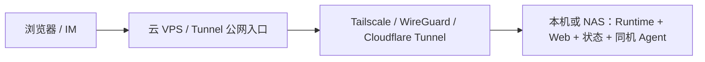

# 场景化部署与验收

本文给出三种可落地的上手路径。共同原则是先验证确定性的 `fake` 链路，再验证一个真实 Agent；不要用模型认证问题代替平台健康检查。

## 1. 如何选择

| 场景 | 推荐用途 | 控制面与 Web | Agent 执行 | 结论 |
| --- | --- | --- | --- | --- |
| 本机电脑或 NAS | 首次上手、个人长期使用、家庭实验室 | 本机/NAS Docker | 当前可在同一 Runtime 容器执行 | **首选** |
| 单台 VPS | 演示、低并发公网访问 | VPS Docker/systemd | 同机执行，2C2G 固定并发 1 | 可用但资源余量小 |
| 本机/NAS + 云端 | 本地保存状态、云端提供公网入口或后续扩展 | 本机/NAS | 现阶段先同机执行；云 VPS 可做反代/隧道 | 进阶，需理解现行边界 |

## 2. 通用四级验收

任何拓扑都按同一顺序验收：

1. **L0 环境**：Docker、磁盘、端口、DNS/私网可用。
2. **L1 平台**：`/health`、登录、Client/Admin、Execution Unit 正常。
3. **L2 业务**：fake Task 完成，Chat/WebShell、DAG、artifact、evaluation、audit 完整。
4. **L3 真实 Agent**：指定 adapter 的结果必须显示 `execution_mode=real-cli`；`protocol-simulated` 不算通过。

本机快速门禁：

```bash
make local-doctor
make local-up
make local-smoke
make local-demo
```

## 3. 本机电脑或 NAS

### 启动

```bash
git clone https://github.com/chiga0/aflow.git
cd aflow
make local-up
make local-demo
```

默认只监听 `127.0.0.1:8765`。NAS 需要局域网访问时：

```bash
python3 scripts/local_stack.py up --bind 0.0.0.0
```

仅允许可信局域网、防火墙白名单或 Tailscale/WireGuard 访问 8765。状态目录默认为 `.aflow/local-data`，应纳入 NAS 快照或备份。

### 验收

```bash
make local-status
make local-smoke
python3 scripts/local_stack.py demo --adapter fake
```

启用真实 CLI 后，再执行：

```bash
python3 scripts/local_stack.py demo --adapter codex --require-real-cli --timeout 600
```

通过标准：终端输出 `status=completed`，且 `execution_mode` 只有 `real-cli`，Client 任务详情能看到持续输出和最终产物。

## 4. 单台 VPS

### 资源策略

2C2G 只建议：低并发控制面、SQLite、一个轻量 Agent、`capacity=1`。不要同时执行前端构建、Playwright、Docker build 和多个真实 Agent。

部署可使用 `Deploy Runtime` workflow，或参考 `deploy/runtime.2c2g.env.example` 手工部署。GitHub Actions 需要 VPS 的 SSH 22 端口对 GitHub-hosted runner 可达。

### 验收

```bash
curl -fsS "https://<domain>/cloud-agents/health"

PYTHONPATH=runtime python3 scripts/smoke_v2_control_plane.py \
  --base-url "https://<domain>/cloud-agents" \
  --email "$RUNTIME_AUTH_EMAIL" \
  --password "$RUNTIME_AUTH_PASSWORD" \
  --timeout 20
```

然后在 Client 创建 fake Task，再创建一个真实 Agent Task。若部署 workflow 在 SSH 上传阶段失败，说明应用尚未更新；即使 CI 测试通过，也不能宣称 VPS 部署成功。

## 5. 本机/NAS + 云端

### 当前推荐形态



这样低配 VPS 只承担 TLS、域名和流量入口，状态与重计算留在本机/NAS。先验证：

- 公网入口不能绕过登录和权限；
- Tunnel/VPN 断开时不会把 8765 暴露到公网；
- fake 与真实 Agent 均在本机/NAS完成；
- 数据目录备份可恢复。

### 现行跨机执行边界

当前产品 Task 路径（`/v2/tasks`）会选择 Execution Unit 并记录调度信息，但真实 CLI 子进程仍在 Runtime 所在环境启动。仓库中的 Remote Worker lease/heartbeat 链路主要服务 Runtime Run API；它尚不能被视为“V2 Task 已在另一台云主机端到端执行”的生产证明。

因此目前不要仅凭 Admin 中注册了云 Execution Unit，就宣称已完成分布式执行。生产化的本机控制面 + 云端 V2 Agent worker 还需要补齐并验证：任务领取协议、workspace/secret 下发、事件与 artifact 回传、取消/重试、断线恢复和版本兼容。

在这之前有两个安全选择：

1. 云端只做公网入口，真实 Agent 留在本机/NAS；这是当前推荐方案。
2. 将整套 Runtime 部署到云端，让 Agent 与控制面同机；这是单 VPS 方案，不属于真正分布式执行。

## 6. 发布门禁

| 门禁 | 必须证据 |
| --- | --- |
| 代码质量 | Runtime CI 全绿 |
| 文档 | `mkdocs build --strict` 通过，Deploy MkDocs 成功 |
| 部署 | Deploy Runtime 成功，目标 revision 等于 main commit |
| 平台 | health、登录、control-plane smoke 通过 |
| 用户链路 | 输入任务后进入 Chat，实时输出为主视图，多 Agent 可切换 |
| Agent | 至少一个真实 adapter 为 `real-cli` |
| 运维 | 备份位置、恢复步骤、资源上限、外部告警明确 |

仓库已关闭定时 `Runtime Monitor` CI。`scripts/monitor_runtime.py` 可以人工运行，但生产可用性告警应由独立监控系统承担，避免周期性 CI 消耗和模型调用。
