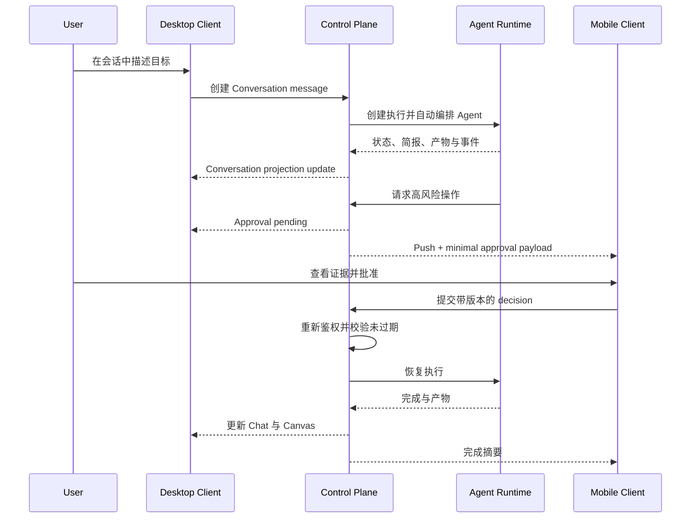

# AgentFlow Client 重设计与重构方案

## 1. 文档目的

本文定义 AgentFlow Client 的下一代产品形态、桌面端与移动端交互、领域模型、前后端边界、迁移顺序和验收标准。

目标不是复制 Codex App 的视觉皮肤，而是借鉴其稳定的使用心智：用户在一个持续存在的会话中描述目标，系统在后台组织执行；复杂信息按需进入上下文画布；系统只在真正需要人类判断时打断用户。

本文是实施前的产品和架构基线。涉及 Client 的设计与实现决策，应优先满足本文的原则与验收标准。

## 2. 结论摘要

当前 Client 以 Task Dashboard 为中心，直接暴露 Mode、Channel、Adapter、Workflow、Event 和 Evaluation 等平台概念。它适合验证后端能力，但不适合作为长期用户界面。

新 Client 应转为“会话式 Agent 工作空间”：

- **Conversation 是用户一级对象**，Task、Run、Workflow、AgentTask 是会话内部执行细节。
- **Chat 是主要入口**，用于表达意图、追加上下文、接收简报和做出决策。
- **Canvas 是复杂结果承载区**，用于计划、DAG、Diff、Artifact、文件、评估和运行详情。
- **Activity 是非阻塞执行反馈**，长任务不能锁死当前会话或抢占焦点。
- **Approval 是一等交互对象**，桌面端提供证据详情，移动端提供低认知负载的分诊闭环。
- **多 Agent 是系统能力，不是用户必须理解的模式**。系统默认自动编排，高级控制收进二级入口。
- **移动端是决策控制台，不是缩小版桌面端**。移动端只消费状态快照、审批请求、摘要和结果。

## 3. 设计原则

### 3.1 结果优先

用户表达想要的结果，而不是先配置执行系统。默认输入框不展示 Mode、Channel、Adapter、Workflow Engine 等字段。

### 3.2 渐进式披露

界面默认只显示：

- 用户消息；
- 当前行动；
- 阶段性简报；
- 需要用户处理的事项；
- 最终结果。

思考过程、工具调用、终端流、内部 Agent 消息、原始事件和重试细节默认折叠。

### 3.3 非阻塞执行

用户可以在任务运行时切换会话、创建新会话、查看文件或处理另一个审批。后台执行不得自动滚动、弹窗抢焦点或替换当前画布。

### 3.4 决策与算力分离

桌面端和云端承担扫描、计算、编排、构建与生成；移动端承担查看状态、批准、拒绝、暂停和简短追问。

### 3.5 可恢复与可解释

用户必须随时知道：

1. 系统正在做什么；
2. 为什么这样做；
3. 是否仍在推进；
4. 是否需要自己决策；
5. 停止、失败或离线后如何恢复。

### 3.6 能力与心智解耦

后端可以保留 Task、Mission、Run、Workflow、Event、Replay 等能力，但 Client 只使用稳定的用户语义：会话、消息、活动、审批、产物和结果。

## 4. 目标用户心智

### 4.1 用户认为自己在做什么

> 我正在一个持续存在的工作会话里与 AgentFlow 协作。它会自动组织多个 Agent，并在需要我判断时准确地问我。

用户不应感觉自己在“创建 Workflow”“选择执行单元”或“观看事件总线”。

### 4.2 五个稳定对象

| 用户对象 | 用户理解 | 后端可能映射 |
| --- | --- | --- |
| 会话 Conversation | 一项持续协作，可多轮继续 | 一个或多个 Task/Run/Mission |
| 消息 Message | 人和系统之间有意义的信息 | 用户输入、投影后的 Event |
| 活动 Activity | 后台正在推进的工作 | Run、Workflow、AgentTask 状态 |
| 审批 Approval | 需要人类承担的决策 | Permission 与风险策略 |
| 产物 Artifact | 可以查看、使用或交付的结果 | Artifact、Diff、Report、Evaluation |

### 4.3 不进入默认心智的对象

- Adapter；
- Execution Unit；
- Canonical Event；
- Replay Snapshot；
- Workflow Engine；
- Agent Contract；
- Tenant/RBAC 实现细节。

这些对象保留在高级设置、开发者视图或 Admin 中。

## 5. 桌面端信息架构

### 5.1 总体布局

```text
┌────────────────┬────────────────────────────────┬────────────────────────┐
│ Conversation   │ Chat / Command Stream          │ Context Canvas         │
│ Sidebar        │                                │                        │
│                │ 用户消息                       │ Plan / Multi-Agent DAG │
│ + 新建会话      │ Agent 阶段简报                 │ Diff / Files           │
│ 搜索            │ 审批卡片                       │ Artifact / Preview     │
│ 项目与时间分组   │ 最终结果                       │ Evaluation / Activity  │
│ 会话状态         │                                │                        │
│                │ Composer                       │                        │
└────────────────┴────────────────────────────────┴────────────────────────┘
                         Activity Capsule
```

桌面宽屏默认左栏加中栏。右侧 Canvas 在用户点击计划、文件、Agent、产物或运行详情后打开。小屏桌面和平板将 Canvas 变为抽屉或独立页面。

### 5.2 左侧会话栏

固定宽度建议为 248–280 px，职责只有导航和态势提示。

顶部：

- 新建会话；
- 搜索；
- 待处理审批入口；
- 已归档入口；
- Admin 入口，仅向有权限角色显示。

会话分组：

- 按 Project/Workspace 分组；
- 项目内按“今天、昨天、过去 7 天、更早”排序；
- 默认按照最后有效活动时间倒序；
- 支持 Pin、重命名、归档、删除和复制链接。

每条会话只展示：

- 自动生成或用户修改的标题；
- 最后一次有意义的状态摘要；
- 运行、等待决策、失败或未读标识；
- 未处理审批数量。

不展示百分比进度，除非后端有可靠的确定性阶段。未知总量任务使用活动状态，不制造虚假精确度。

### 5.3 Chat 主区域

Chat 是连续阅读流，不是原始日志流。

#### 消息类型

| 类型 | 默认呈现 | 用户操作 |
| --- | --- | --- |
| User message | 完整文本、附件 | 编辑后重试、复制 |
| Agent brief | 当前行动或阶段结论 | 展开细节、打开 Canvas |
| Plan summary | 一句话计划和 Agent 数量 | 查看计划 |
| Approval card | 意图、证据摘要、影响 | 批准、拒绝、查看详情 |
| Result | 结论、关键产物、下一步 | 打开产物、继续追问 |
| Error/Paused | 人类可理解的原因 | 重试、修改指令、恢复 |
| Tool/Debug | 默认折叠 | 展开原始信息 |

#### 降噪规则

- 连续工具事件合并为一张“执行了 N 项操作”的 Activity 卡；
- Token delta 合并为稳定消息，避免阅读区闪烁；
- Agent 内部讨论不直接进入主 Chat；
- 只有改变用户决策或任务方向的信息才能成为一级消息；
- 相同错误重试只更新一张状态卡，不重复刷屏；
- 完成后生成面向结果的总结，而不是展示最后一条终端输出。

### 5.4 Composer 输入区

输入区固定在 Chat 底部，但不能遮挡最后一条消息。

一级能力：

- 多行输入；
- 添加文件、图片和已有产物；
- 发送；
- 运行时变为 Stop；
- 键盘与语音输入的无障碍标签。

二级能力：

- Workspace/Project；
- 执行权限策略；
- 模型或 Agent Profile；
- 高级执行策略；
- 计划优先或直接执行。

`Auto / Workflow / Multi-agent` 不应作为新建任务的必选大卡片。默认由系统选择；高级用户可以覆盖，覆盖结果在发送前清晰可见。

### 5.5 Context Canvas

Canvas 使用稳定的标签或面包屑，支持关闭、扩大和恢复上次宽度。

支持以下渲染器：

1. Plan：任务范围、阶段和依赖；
2. Agents：多 Agent DAG、角色、输入、输出和状态；
3. Diff：文件级和行级修改、风险标记；
4. Files：Workspace 文件浏览与预览；
5. Artifact：报告、表格、图片、链接和下载；
6. Workflow：确定性 Pipeline 和重试；
7. Evaluation：验收条件、证据和失败原因；
8. Activity：折叠后的工具、终端和事件调试视图。

Canvas 内容必须由结构化数据驱动，不能依赖从自然语言回答中解析 UI。

### 5.6 多 Agent 表达

多 Agent 的默认 Chat 表达应是：

> 已拆分为 3 个并行分析方向，正在执行。你可以继续处理其他会话。

Canvas 才呈现拓扑。每个 Agent 节点只展示：

- 角色；
- 目标；
- 当前行动；
- 状态；
- 依赖；
- 产物；
- 是否等待决策。

点击节点后，Chat 可以定位到与该节点有关的阶段简报；点击简报也可以在 Canvas 高亮节点。用户不需要阅读 Agent 间内部消息。

当拓扑复杂时，以用户目标为中心锚点：左侧表示输入依赖和证据来源，右侧表示 Agent 执行路径与输出汇聚。移动端不渲染完整拓扑。

### 5.7 Activity Capsule

窗口角落持续显示全局活动：

- 当前微状态，例如“正在扫描 43 个文件”；
- 活动会话数；
- 等待审批状态；
- 点击展开 Activity Center；
- 一键停止当前任务；
- 停止前说明影响，避免把“停止显示”误解为“终止远端执行”。

Activity 更新不得自动打开会话或改变当前 Canvas。

## 6. 移动端设计

### 6.1 定位与边界

移动端定位为 Triage Console：查看、分诊、决策、恢复和轻量追问。

移动端第一阶段包含：

- 活动与等待决策首页；
- 会话列表与搜索；
- 会话摘要；
- 审批队列；
- 结果与关键产物预览；
- 简短追问；
- Pause、Resume、Stop。

明确不包含：

- 完整代码仓库同步；
- 大型 DAG 操作；
- 完整终端；
- 复杂 Diff 编辑；
- 执行单元与渠道配置；
- 原始事件调试。

### 6.2 移动端首页

首页按用户行动优先级排序：

1. 等待我处理；
2. 运行中；
3. 最近完成；
4. 最近会话。

运行状态使用活动环或阶段环，但只有阶段总数可靠时才显示完成比例；否则显示呼吸状态和当前行动文本。

### 6.3 审批卡片

每张审批卡片固定包含：

- 意图：Agent 想做什么；
- 证据：关键 Diff、命令、截图或资源；
- 影响：风险级别、影响范围、可逆性；
- 决策：批准、拒绝、暂停或要求修改。

第一版使用明确按钮，不以滑动作为唯一操作。滑动手势可以作为增强，但必须支持撤销、无障碍操作和二次确认策略。

高风险批准要求再次确认，并展示批准范围和有效期。拒绝时允许填写简短原因，该原因进入同一会话并指导后续计划。

### 6.4 无状态渲染

移动端只接收裁剪后的 `ConversationSnapshot`、`ApprovalRequest` 和通知载荷，不拉取完整 Workspace、终端历史或 Canonical Event。

离线时允许查看最近快照，但所有决策必须在服务端重新校验审批状态、用户身份、版本和过期时间。客户端不能通过本地状态宣告审批成功。

### 6.5 响应式降级

| 桌面能力 | 平板 | 手机 |
| --- | --- | --- |
| 固定会话栏 | 可折叠栏 | 独立会话页 |
| Chat + Canvas | Chat + 抽屉 | Chat 与详情独立路由 |
| 完整 DAG | 可缩放只读 | 阶段列表 |
| 完整 Diff | 文件级 Diff | 摘要与关键片段 |
| Activity Capsule | 底部浮层 | 首页活动卡/系统通知 |

## 7. 跨端生命周期



## 8. 领域模型与 API 重构

### 8.1 推荐模型

```text
Conversation
├── Message
├── Execution
│   ├── Plan
│   ├── AgentTask
│   ├── Run / Workflow
│   └── Activity
├── Approval
├── Artifact
└── Evaluation
```

`Conversation` 可以包含多次 Execution。用户追问可能只是新增消息，也可能触发新的 Execution。不能继续假设“一条会话等于一个 Task”。

### 8.2 Conversation

```ts
interface Conversation {
  conversation_id: string;
  tenant_id: string;
  project_id: string;
  title: string;
  status: "idle" | "active" | "waiting_user" | "failed" | "completed";
  last_meaningful_activity_at: string;
  unread_count: number;
  pending_approval_count: number;
  pinned_at?: string;
  archived_at?: string;
  version: number;
}
```

### 8.3 Message

```ts
interface ConversationMessage {
  message_id: string;
  conversation_id: string;
  role: "user" | "agent" | "system";
  kind: "text" | "brief" | "plan" | "approval" | "result" | "error";
  content: Array<TextBlock | AttachmentBlock | EntityRefBlock>;
  execution_id?: string;
  created_at: string;
  revision: number;
}
```

消息内容使用显式 block 和实体引用。Chat 通过实体引用打开 Canvas，而不是把 Artifact 或 DAG 塞进 Markdown。

### 8.4 Approval

```ts
interface ApprovalRequest {
  approval_id: string;
  conversation_id: string;
  execution_id: string;
  intent: string;
  evidence: EvidenceRef[];
  impact: {
    level: "low" | "medium" | "high";
    summary: string;
    affected_resources: string[];
    reversible: boolean;
  };
  allowed_actions: Array<"approve" | "reject" | "pause" | "revise">;
  scope: Record<string, unknown>;
  status: "pending" | "approved" | "rejected" | "expired" | "cancelled";
  version: number;
  expires_at?: string;
}
```

决策请求必须携带 `version` 或 ETag，服务端以 compare-and-set 保证跨端只生效一次。

### 8.5 Conversation Projection

现有 Canonical Event 继续作为事实来源，新增 Projection 层生成：

- 会话列表摘要；
- Chat 消息；
- 当前活动；
- 未处理审批；
- Canvas 实体索引；
- 移动端快照。

Projection 规则必须版本化、可重建和幂等。客户端不负责把原始事件解释成产品语义。

### 8.6 推荐 API

```text
GET    /conversations
POST   /conversations
GET    /conversations/{id}
PATCH  /conversations/{id}
GET    /conversations/{id}/messages?after=
POST   /conversations/{id}/messages
GET    /conversations/{id}/activity
POST   /conversations/{id}/stop
GET    /conversations/{id}/canvas
GET    /conversations/{id}/artifacts
GET    /approvals?status=pending
GET    /approvals/{id}
POST   /approvals/{id}/decision
GET    /mobile/snapshot
```

实时更新优先使用 SSE；断线重连携带最后事件游标。轮询保留为降级路径，不应继续让每个页面组件独立高频轮询多个端点。

## 9. 前端架构

### 9.1 路由

```text
/                              新会话或最近会话
/c/{conversationId}            会话工作区
/c/{conversationId}/plan       打开 Plan Canvas
/c/{conversationId}/agents     打开 Agents Canvas
/c/{conversationId}/a/{id}     打开 Artifact
/approvals                     审批收件箱
/activity                      全局活动中心
/admin/*                       管理控制台
```

Canvas 路由应可深链接，并在移动端自然降级为独立页面。

### 9.2 组件边界

```text
ClientAppShell
├── ConversationSidebar
├── ConversationWorkspace
│   ├── ConversationHeader
│   ├── MessageStream
│   ├── Composer
│   └── ContextCanvas
└── ActivityCapsule

MobileAppShell
├── TriageHome
├── MobileConversation
├── ApprovalInbox
└── EntityDetail
```

### 9.3 状态职责

- 服务端状态使用统一 Query 层和 SSE cache 更新；
- Canvas 是否打开、宽度、折叠项属于本地 UI 状态；
- 草稿按 Conversation 本地保存；
- 审批按钮提交后进入 `submitting`，必须等待服务端确认；
- 乐观更新仅用于标题、Pin 和归档等可回滚操作；
- Stop、Approve、Reject 不做伪成功乐观更新。

## 10. 当前能力迁移映射

| 当前 Client | 新位置 | 处理方式 |
| --- | --- | --- |
| New Task | 新会话 Composer | 保留创建能力，隐藏平台字段 |
| Task Track | Conversation Sidebar | 先投影 Task，后接 Conversation |
| Qwen WebShell | Chat + Activity | 语义事件进入 Chat，原始流进入调试区 |
| Plan DAG | Plan/Agents Canvas | 保留结构化数据 |
| Durable Workflow | Workflow Canvas | 只在确定性流程时呈现 |
| Artifacts | Artifact Canvas | 增加预览、下载与权限状态 |
| Evaluations | Result/Evaluation Canvas | 转为验收条件和证据 |
| Replay Snapshots | 高级会话历史 | 不进入默认页面 |
| Canonical Events | Activity 调试视图 | 默认折叠 |
| Agent Contracts | Agent 节点详情 | 使用用户语言重命名字段 |
| Mode/Channel/Adapter | Composer 高级菜单/Admin | 默认 Auto |
| Workload/Dispatch Trust | Admin | 从 Client 移除 |

## 11. 空状态、异常与边界状态

### 11.1 必须设计的状态

- 首次使用且没有会话；
- 会话加载中；
- Agent 正常运行；
- 任务运行但暂时没有新输出；
- 等待审批；
- 用户主动暂停；
- 网络断开但远端可能仍在运行；
- 运行时刷新页面；
- 跨端重复审批；
- 审批已过期；
- 部分 Agent 失败但整体可继续；
- 执行单元离线；
- Artifact 无权限、已删除或尚未生成；
- Stop 请求已发送但尚未确认；
- 会话内容过长；
- 移动端收到旧推送。

### 11.2 状态文案原则

错误文案必须回答“发生了什么、当前是否仍在执行、用户可以做什么”。例如：

> 与服务暂时断开。远端任务可能仍在运行；恢复连接前请勿重复批准。我们会自动重连，你也可以返回会话列表。

不得只显示 `500`、`failed`、`stale` 或 Adapter 原始异常。

## 12. 权限、安全与隐私

- Conversation、Message、Approval、Artifact 必须使用相同的 tenant/project 访问判断；
- 移动端通知不携带敏感 Diff、密钥、完整命令或源文件；
- Push 只携带不敏感摘要和资源 ID，打开 App 后重新鉴权获取详情；
- 高风险审批显示批准范围、目标环境、可逆性和过期时间；
- Approval decision 必须防重放、带版本、记录操作者与设备；
- 终端输出与 Artifact 在渲染前进行密钥和个人信息脱敏；
- 外部链接、下载和复制操作明确标识来源；
- 会话分享默认关闭，开启时使用可撤销、可过期授权；
- 审计日志记录事实，但不默认展示模型隐藏思考过程。

## 13. 可访问性与国际化

- 所有功能支持键盘操作，不把 hover 或 swipe 作为唯一入口；
- 审批颜色之外必须有文字和图标；
- 运行呼吸动画尊重 `prefers-reduced-motion`；
- Chat 新消息使用克制的 `aria-live`，工具流不持续打断屏幕阅读器；
- Canvas 关闭后焦点回到触发元素；
- 桌面分栏支持 200% 缩放；
- 中英文文案不依赖固定宽度；
- 时间显示本地化，同时保留可访问的完整时间；
- 移动端点击目标不少于 44×44 px。

## 14. 性能与可靠性指标

| 指标 | 目标 |
| --- | --- |
| 会话列表可交互 | P75 < 1.5 s |
| 打开已有会话首屏 | P75 < 2 s |
| 用户发送后本地确认 | < 100 ms |
| 服务端接收确认 | P95 < 1 s |
| 运行状态新鲜度 | 在线 SSE < 2 s |
| 审批跨端同步 | P95 < 3 s |
| 断线恢复 | 不重复消息、不重复决策 |
| 10k 消息会话 | 虚拟化后可平滑滚动 |

消息流、DAG、Diff 和事件列表必须虚拟化或分页。不可在打开会话时一次加载全部 Canonical Event。

## 15. 分阶段实施

### Phase 0：契约与观测

- 定义 Conversation、Message、Activity、Approval Schema；
- 建立 Event → Conversation Projection 规则；
- 为当前 Task API 增加投影对照测试；
- 建立前端体验指标和埋点。

退出条件：同一 Task 可以稳定投影出会话摘要和消息流，重建结果一致。

### Phase 1：桌面核心骨架

- 三栏 Client App Shell；
- 左侧会话管理；
- 中央 Chat 消息模型；
- Composer 与持续会话；
- 运行状态和 Stop；
- 现有 Task 临时映射为 Conversation。

退出条件：用户不进入 Admin、不理解 Mode/Adapter，也能创建、切换、继续和停止任务。

### Phase 2：多 Agent 与 Canvas

- Plan/Agents Canvas；
- Chat 与节点双向定位；
- Artifact、Diff、Evaluation 渲染；
- Activity 降噪与调试视图；
- Activity Capsule。

退出条件：复杂多 Agent 任务在 Chat 中保持简洁，同时能在 Canvas 回答“谁在做什么、依赖什么、产生什么”。

### Phase 3：审批与移动端

- 统一 Approval 模型；
- 审批收件箱；
- 移动 Snapshot API；
- Push Relay；
- 移动端 Approve/Reject/Pause/Revise；
- 离线、过期和重复决策保护。

退出条件：用户离开桌面后可安全处理阻塞任务，且移动端不需要完整 Workspace 数据。

### Phase 4：迁移与清理

- Conversation 支持多次 Execution；
- 迁移旧 Task 深链接；
- 删除 Client 中重复的 Dashboard 组件；
- Canonical Event 和执行单元能力完全移入开发者/Admin；
- 更新用户指南和运维文档。

## 16. 产品验收场景

### 16.1 首次使用

用户打开 Client，能在 10 秒内理解输入框的用途并发送第一条任务；无需选择执行模式或 CLI。

### 16.2 并行工作

一个长任务运行时，用户创建第二个会话。第一个任务继续运行，不抢焦点；左栏和 Activity Capsule 正确显示状态。

### 16.3 多 Agent 理解

用户不阅读原始日志，也能回答：当前有几个工作方向、哪个已完成、哪个被阻塞、最终产物在哪里。

### 16.4 桌面到移动审批

桌面任务触发高风险操作，手机收到不泄密的通知。用户进入 App 后查看证据和影响并批准；桌面端在 3 秒内同步状态且执行只恢复一次。

### 16.5 离线恢复

桌面断网后明确告知远端可能仍运行。恢复连接后不会重复发送用户消息、创建 Task 或重复批准。

### 16.6 失败恢复

部分 Agent 失败时，用户看到可理解的影响和选项：仅重试失败步骤、修改目标后继续、接受部分结果或停止全部任务。

## 17. 多轮审计记录

### Round 1：用户心智与信息架构审计

发现与修订：

1. 初稿仍把 Task 近似为会话；修订为 Conversation 可包含多次 Execution。
2. 初稿给会话列表展示百分比；修订为只有确定性阶段才展示比例，其他任务只显示活动状态。
3. 初稿把多 Agent 作为显著模式入口；修订为默认 Auto，高级菜单才允许覆盖。
4. 初稿右侧 Canvas 始终存在；修订为按需打开，小屏降级为抽屉或路由。
5. 初稿没有定义 Chat 降噪门槛；补充一级消息准入和事件合并规则。

审计结论：信息架构已从“控制平台对象导航”转为“用户工作对象导航”。

### Round 2：跨端、多 Agent、安全与异常审计

发现与修订：

1. 滑动审批容易误触且不利于无障碍；修订为按钮是基础操作，滑动仅增强并支持撤销。
2. 移动端 Push 可能泄露代码与 Diff；修订为通知只含不敏感摘要，详情重新鉴权获取。
3. 桌面与手机可能同时审批；增加 Approval version/ETag 和服务端 compare-and-set。
4. 网络断开时用户可能重复批准或重复创建任务；增加幂等键、服务端确认和明确离线文案。
5. 大型 DAG 不适合手机；移动端改为阶段列表和关键阻塞项。
6. Agent 内部消息可能污染 Chat；明确内部通信仅进入调试视图。

审计结论：跨端职责清晰，审批闭环具备安全边界，移动端不再是桌面端缩放版。

### Round 3：工程可落地性与迁移审计

发现与修订：

1. 一次性替换 Task 模型风险过高；增加临时 Task → Conversation 投影和四阶段迁移。
2. 当前页面通过多个高频轮询获取状态；增加统一 SSE cache，轮询仅作为降级。
3. 原始 Event 在前端解释会导致不同端语义漂移；Projection 下沉服务端并要求版本化和可重建。
4. Canvas 深链接和移动降级未定义；补充实体路由。
5. Stop 与审批若采用乐观成功会产生错误安全感；明确必须等待服务端确认。
6. 缺少量化验收；补充性能、同步、可用性和场景验收标准。

审计结论：方案可以在保留现有运行时的前提下渐进实施，关键风险集中在 Projection、Approval 一致性和旧链接迁移，可通过 Phase 0 契约测试前置化。

## 18. 最终设计检查清单

实施与复核结果：

- [x] 用户始终从会话和目标出发，而非平台配置。
- [x] 默认 Chat 只显示影响理解与决策的信息。
- [x] 多 Agent 可被理解，但默认由系统组织，无需用户手动编排。
- [x] 长任务不抢焦点，并提供全局 Stop。
- [x] Canvas 按需打开，8 个结构化视图均有稳定深链。
- [x] 移动端只承担状态分诊、证据查看和关键决策。
- [x] 审批包含意图、证据、影响和明确动作。
- [x] Approval version/CAS 阻止跨端重复审批，高风险批准要求二次确认。
- [x] 离线、过期、部分失败和远端仍运行均有明确反馈。
- [x] 原始事件和内部 Agent 通信默认折叠。
- [x] Conversation Projection 已版本化、可重建、幂等，并按新事件增量刷新。
- [x] 旧 Task 深链自动迁移到 Conversation，持续会话支持多次 Execution。
- [x] 键盘焦点、屏幕阅读语义、减少动画和 44px 移动触控目标已验证。
- [x] 性能、覆盖率、跨端同步和真实 CLI 场景均有可重复测试。

## 19. 2026-07-17 完整实施与验证结论

本轮不再把结果定义为“视觉重构基线”。Client 的正式产品对象是 Conversation；Task、Workflow、Event 和执行单元保留为运行时与 Admin 对象。桌面端采用会话导航、Chat 与 Context Canvas 的非对称工作区；移动端采用无状态快照与审批分诊，而不是缩小版开发工具。

### 19.1 已落地架构

- 会话优先：新建、搜索、置顶、归档、筛选、持续追问、多 Execution、旧 Task 深链迁移。
- Chat 降噪：用户消息、阶段简报、审批、错误与最终结果进入主流；原始事件默认折叠。
- Context Canvas：计划、Agent、变更、文件、产物、流程、验收、活动 8 个结构化视图。
- 实体联动：计划、Agent 和产物支持 URL 深链；Chat 简报可定位 Canvas，Agent 节点可定位回 Chat。
- 多 Agent：默认 Auto，可由系统拆解；本地执行器按依赖顺序调度，状态、依赖、产物与验收可观察。
- 审批：统一 Approval 模型、收件箱、证据与影响卡片、Approve/Reject/Pause/Revise、版本化 CAS、高风险二次确认。
- 移动端：决策台、状态快照、脱敏通知 Relay、浏览器通知、离线缓存、断网禁决策、44px 触控目标。
- 实时与恢复：SSE 优先、游标续传、轮询降级、Stop、仅重试失败步骤、修改目标、接受部分结果。
- Projection：Canonical Event 为事实源；Projection v2 可确定性重建，日常读取只增量投影新事件，避免全量删除重写。
- 安全与迁移：按认证用户校验会话与审批；旧 Task 路由自动迁移；Client 不再暴露重复的 Task 工作区。

### 19.2 阶段退出条件

1. Phase 0：Schema、Projection、版本迁移与契约测试完成。
2. Phase 1：用户不进入 Admin、不选择 Mode/Adapter，也能创建、切换、继续和停止会话。
3. Phase 2：复杂任务可在 Chat 保持简洁，并在 8 类 Canvas 中回答计划、依赖、变更、产物与验收。
4. Phase 3：桌面与移动审批闭环、Relay、离线与重复决策保护完成。
5. Phase 4：Conversation 多 Execution、旧链接迁移、Client 重复 Task 页面清理和用户指南更新完成。

### 19.3 多轮实现审计

#### Round 4：运行时与取消一致性

- Stop 从状态更新扩展为进程组终止，避免 Qwen 子进程遗留和管道悬挂。
- 显式 single 模式保持单 Agent，不因长目标被意外扩展。
- Qwen stream-json 采用健壮解析，最终摘要与原始协议证据分离。
- 高风险任务在审批前不创建 CLI 进程、不产生 Agent started 事件。

#### Round 5：真实浏览器与移动可用性

- 修复 390×844 视口横向溢出、固定 Composer 遮挡和 Canvas 定位。
- Composer、选择器、通知与审批按钮在移动端均不小于 44px。
- 高风险确认默认聚焦“返回检查”；Esc 关闭后焦点回到“批准并继续”。
- 内部状态值改为用户文案；真实移动审批闭环提交成功；Console Error 为 0。

#### Round 6：Projection 与性能

- 修复读取消息时全量 DELETE + INSERT 的高严重度问题。
- 当前 Projection 只读取各 Execution 尚未投影的新事件；规则版本变化时才执行一次全量重建。
- 重建结果、分页结果和多 Execution 消息顺序由测试验证。
- Conversation-native 列表不再反复扫描 Task 表；旧任务仅在深链迁移时按需投影。

#### Round 7：Canvas 与迁移完整性

- 将原 3 个聚合标签拆为 8 个稳定结构化渲染器。
- 增加实体级 Canvas URL、Chat→Canvas 与 Agent→Chat 双向定位。
- Activity 增加默认折叠的 Canonical Event 调试视图。
- 旧 /tasks/{id} 自动解析 Conversation 并替换历史路由；重复 Task 工作区及私有渲染代码已删除。

#### Round 8：真实 Qwen CLI 联合验收

同一次验收中，代码审计、运维巡检、多阶段研究、文件生成和高风险审批全部完成。每个 Agent 均满足 real-cli、exit_code=0、非空可读摘要、原始证据、每 Agent 一个 Artifact 与一个 Evaluation。高风险任务额外验证审批前零执行、通知不泄漏任务细节和 CAS 版本批准。

| 任务类型 | Task ID | 验收结果 |
| --- | --- | --- |
| 代码审计 | `task_d702e11da0af4cc9bce4bd3b520c018e` | 完成，真实 Qwen exit 0 |
| 运维巡检 | `task_a9432ef2936347c2950cceebd142632b` | 完成，只读证据与健康判断齐全 |
| 多阶段研究 | `task_5d7952eb97044741982ef7d628475bbd` | Brain、Builder、Reviewer 全部完成 |
| 文件生成 | `task_fe9b317b22244d97bb72b8f482a8c6e2` | 完成，并复读验证唯一允许文件 |
| 高风险审批 | `task_309a8fb4d62042ddb28f986d6c51328b` | 审批前零执行，批准后完成并返回安全 NO_GO |

#### Round 9：发布前独立复审与体验收口

- 真实 Qwen 再次执行代码审计 `task_ecea303a08d54ddaa58431ae2ea3b146`，结论为无阻塞问题。
- Brain、Builder、Reviewer 再次执行多阶段一致性研究 `task_d700bd2523914fff8f7e6e5e03da0ec5`，3 个真实 CLI 进程均 exit 0，结论为六维核心能力可发布。
- 根据有效建议，默认 Composer 只显示“执行设置（高级）”，不再在折叠状态暴露 Mode/Adapter；客户端空状态统一为中文。
- 旧 Task 迁移明确区分 404 失效链接与临时网络故障，分别提供返回会话列表和重新同步动作。
- “离线操作可能丢失”的建议经复核不成立：客户端离线时审批按钮被禁用，不会把未确认决策伪装成已提交。
- Chat 不为每个 Canonical Event 增加按钮，避免重新制造日志噪声；8 类 Canvas 始终通过结构化标签可达，计划、Agent、审批和结果保留上下文深链。

### 19.4 自动化与人工验证矩阵

- 后端：129 个 unittest 在 ResourceWarning 视为错误的严格模式下通过。
- 前端：55 个 Vitest 测试通过；语句覆盖率 95.90%，分支覆盖率 90.06%，函数覆盖率 92.12%。
- E2E：Playwright 桌面与移动共 12 个通过，2 个按设备条件预期跳过。
- 构建：ESLint、Prettier、TypeScript 和 Vite 生产构建通过；主业务包低于 500 kB。
- 文档：MkDocs strict 构建通过。
- 浏览器：390×844 无全局横向溢出，关键触控目标不小于 44px，审批焦点闭环和 Console Error=0。
- 真实执行：联合验收脚本 scripts/validate_v2_qwen_client_tasks.py 通过 5 类任务和 7 次 Qwen 调用。

### 19.5 Go/No-Go

Client 已达到可直接使用标准：在受信任的单组织部署中，用户可以按 Codex App 心智完成会话发起、后台多 Agent 执行、Canvas 检查、跨端审批与失败恢复。

边界必须明确：

- 当前移动形态是响应式 Web 决策台，通知采用安全 Relay + 浏览器通知，不宣称原生 APNs/FCM 客户端。
- 会话与审批按认证用户隔离；当前不宣称已经完成面向不互信租户的强 SaaS 多租户隔离。
- 生产部署仍需要真实目标、凭据、备份与回滚条件。高风险真实验收在缺少这些前提时正确返回 NO_GO。
- Diff 与 Files 只渲染执行器明确返回的结构化数据，不从自然语言猜测，也不会向移动端复制完整代码库。

因此，产品功能 Go；无真实生产凭据的部署动作 No-Go。这一判断与“人类决策控制台”的安全心智一致。
