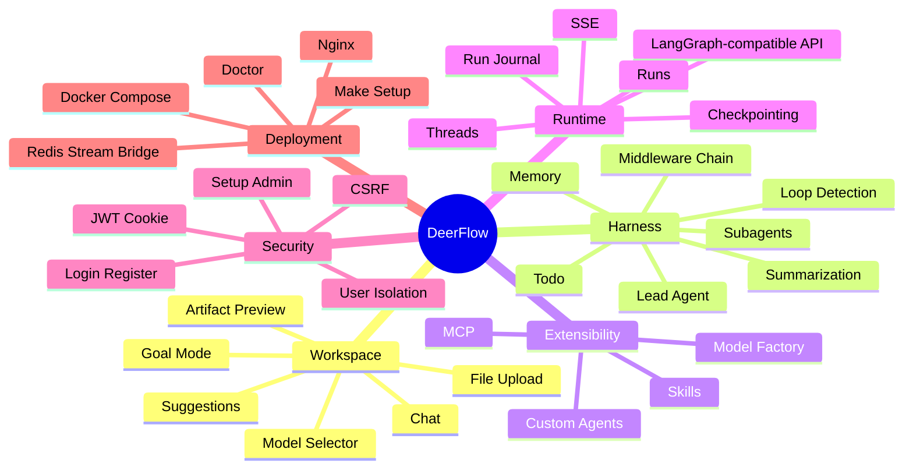
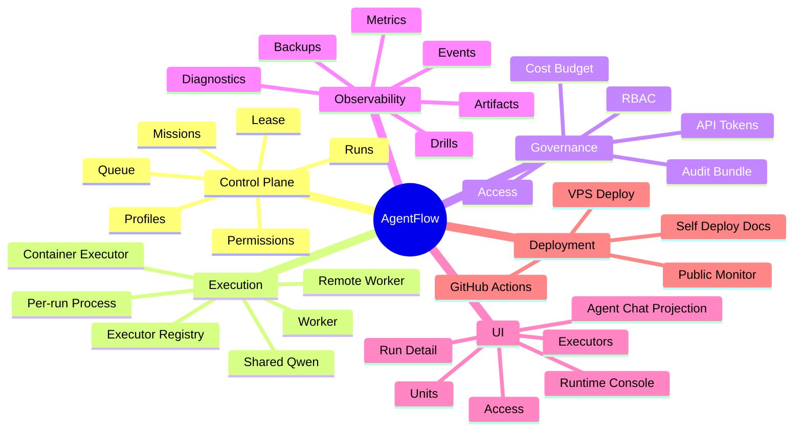

# DeerFlow 深度调研与 AgentFlow 对比报告

> 调研日期：2026-07-04  
> 调研对象：本地开源项目 `deer-flow` 与当前 AgentFlow Runtime。  
> 目标：从产品定位、目标用户、功能形态、架构实现、部署运维、安全治理和后续演进角度，判断 DeerFlow 中哪些能力值得 AgentFlow 借鉴，哪些不适合直接照搬。

## 结论摘要

DeerFlow 和 AgentFlow 不是同一类产品的简单竞争关系。

- **DeerFlow 更像上层 Agent 工作台和 super agent harness**：它面向知识工作者、研究者、创作者和开发者，核心体验是聊天、文件上传、模型选择、skills、memory、sandbox、artifact 预览和多模态工作区。
- **AgentFlow 更像底层 Agent Runtime / Control Plane**：它面向开发者、部署者、管理员和 AI infra 用户，核心能力是 run、mission、worker、executor、queue、lease、permission、artifact、audit 和 CI 部署。
- **DeerFlow 教我们如何让用户愿意用 AgentFlow**：尤其是工作台、输入框、技能生态、用户 onboarding、正式认证和用户隔离。
- **AgentFlow 的主线不应该被 DeerFlow 替代**：AgentFlow 已经在远程 worker、executor registry、部署 CI、运行审计和实机 qwen 验收上形成自己的差异化底座。

最适合的融合方向是：

```text
DeerFlow-like Workspace / Skills / Auth / Memory
            ↓
AgentFlow Run / Mission / Worker / Executor / Audit Runtime
```

也就是说，AgentFlow 应该吸收 DeerFlow 的“用户工作台层”和“能力包机制”，但继续坚持自身的“可部署、可审计、可分布式执行 runtime”。

## 调研范围

本次重点阅读 DeerFlow 的以下区域：

| 区域 | 代表路径 | 关注点 |
| --- | --- | --- |
| 项目说明 | `README.md`、`README_zh.md`、`Install.md` | 产品定位、安装方式、核心功能 |
| 后端架构 | `backend/docs/ARCHITECTURE.md`、`backend/app/gateway/app.py` | FastAPI Gateway、LangGraph runtime、路由组织 |
| Agent harness | `backend/packages/harness/deerflow/agents/lead_agent/agent.py` | lead agent、middleware chain、模型/工具装配 |
| Skills | `backend/packages/harness/deerflow/skills/*`、`skills/public/*` | `SKILL.md`、allowed tools、required secrets、安装启用 |
| Subagents | `backend/packages/harness/deerflow/subagents/*`、`task_tool.py` | 子 Agent 执行、后台任务、token 汇总 |
| Sandbox | `backend/packages/harness/deerflow/sandbox/*` | 本地/远程 sandbox 抽象、虚拟路径 |
| Auth | `backend/docs/AUTH_DESIGN.md`、`backend/app/gateway/auth/*` | setup admin、login/register、JWT cookie、CSRF、用户隔离 |
| 前端工作台 | `frontend/src/components/workspace/*` | chat、input、artifact、settings、skills、移动端布局 |
| 部署 | `docker/docker-compose.yaml`、`Makefile` | nginx/frontend/gateway/redis/provisioner、setup/doctor |

同时对照 AgentFlow 的以下区域：

| 区域 | 代表路径 | 关注点 |
| --- | --- | --- |
| 架构文档 | `docs/architecture.md`、`docs/implementation/index.md` | Run/Mission/Worker/Executor/SAEU |
| Runtime | `runtime/cloud_agents_runtime/manager.py` | RunManager、capabilities、queue、mission |
| Store | `runtime/cloud_agents_runtime/store.py` | SQLite、event、artifact、worker、auth user |
| Worker | `runtime/cloud_agents_runtime/worker.py` | remote worker heartbeat/claim/event/artifact |
| Executor | `runtime/cloud_agents_runtime/executors.py` | shared/per-run/container qwen executor |
| Console | `web/src/app.tsx`、`web/src/lib/api.ts` | 管理台、Access、Run Detail、Workers、Executors |
| 部署 | `.github/workflows/deploy-runtime.yml`、`deploy/*` | CI 自动部署、VPS smoke、public ingress |

## 产品定位对比

### DeerFlow 的产品定位

DeerFlow 的 README 明确把它定义为 open-source super agent harness。它的产品心智不是“运行一个远程进程”，而是“给用户一个可扩展的 AI 工作台”。

它的核心产品承诺是：

- 用一个聊天式工作区完成复杂研究、写作、分析、生成和开发辅助任务。
- 通过 skills 扩展领域能力。
- 通过模型配置、MCP、sandbox、memory、subagents 组合出可定制 agent harness。
- 通过文件上传、artifact、workspace 和 settings 形成完整应用体验。

### AgentFlow 的产品定位

AgentFlow 的目标是把“本地 CLI Agent 执行一次任务”提升为“可长期运行、可审计、可恢复、可交给 worker 执行的云端任务系统”。

它的核心产品承诺是：

- 用户可以创建长时间运行的 Agent run。
- 控制面能观察、取消、审批、恢复和审计任务。
- Worker/Executor 可以部署在 VPS、NAS 或其他机器上。
- qwen/codex/claude/opencode 等执行器可以通过统一 runtime 接入。
- CI 可以保证机器上始终部署最新版本。

### 定位差异

| 维度 | DeerFlow | AgentFlow |
| --- | --- | --- |
| 产品类别 | Agent 工作台 / super agent harness | Agent Runtime / Control Plane |
| 第一入口 | Chat Workspace | Runtime Console / Run 创建 / Worker 状态 |
| 用户心智 | “我让 AI 帮我完成工作” | “我管理 AI 任务如何稳定执行” |
| 核心价值 | 任务完成体验、技能生态、多模态输入输出 | 稳定运行、审计、权限、部署、分布式执行 |
| 技术重心 | LangGraph、middleware、skills、sandbox、memory | queue、lease、worker、executor、artifact、audit |
| 产品风险 | 部署复杂、安全边界重、runtime ops 弱 | 普通用户理解门槛高、工作台体验不足 |

最准确的关系是：**DeerFlow 像上层应用，AgentFlow 像底层运行平台。**

## 目标用户对比

### DeerFlow 目标用户

| 用户 | 诉求 | DeerFlow 的匹配能力 |
| --- | --- | --- |
| 研究者 | 深度调研、资料阅读、报告生成 | deep research skills、文件上传、artifact |
| 创作者 | 撰写文章、播客、图像、PPT、newsletter | public skills、artifact preview |
| 数据分析师 | 分析数据、生成图表、汇总洞察 | data-analysis、chart-visualization skills |
| 开发者 | 用 agent 辅助写代码、查资料、生成文档 | sandbox、tools、subagents、MCP |
| AI 应用开发者 | 自定义模型、工具、skills、memory | config.yaml、MCP、skills API |
| 团队管理员 | 管理用户、skills、认证、部署 | admin setup、auth、settings |

### AgentFlow 目标用户

| 用户 | 诉求 | AgentFlow 的匹配能力 |
| --- | --- | --- |
| 独立开发者 | 把 qwen/codex 类 agent 放到云端长期跑 | VPS 部署、qwen executor、Run Console |
| AI infra 开发者 | 管理多个 agent execution unit | worker registry、executor registry |
| 团队管理员 | 控制权限、成本、worker、任务状态 | Access/RBAC、Cost、Units、Ops |
| SRE/运维 | 知道任务为什么卡住、失败、排队 | queue、heartbeat、diagnostics、artifact |
| 安全/审计用户 | 留下任务、权限、事件、产物证据 | event store、audit bundle、permission events |
| 产品开发者 | 基于 runtime 搭建上层 agent 应用 | `/runs`、`/missions`、`/session` BFF、API token |

### 用户层级判断

AgentFlow 当前已经覆盖了 DeerFlow 不擅长的 infra / runtime 层，但对普通学习者和知识工作者仍偏工程化。

如果 AgentFlow 要走开源产品化路线，应同时提供两种视图：

| 视图 | 面向用户 | 默认展示内容 |
| --- | --- | --- |
| Workspace | 普通用户、学习者、知识工作者 | 输入任务、选择模式、查看过程、查看产物 |
| Admin/Ops Console | 管理员、开发者、SRE | Worker、Executor、Access、Cost、Queue、Audit |

## 功能对比

### DeerFlow 功能地图



### AgentFlow 功能地图



### 功能成熟度对比

| 能力 | DeerFlow | AgentFlow | 判断 |
| --- | --- | --- | --- |
| 用户聊天工作台 | 强 | 中 | DeerFlow 值得借鉴 |
| 文件上传与 artifact 体验 | 强 | 中 | DeerFlow 值得借鉴 |
| Skills 生态 | 强 | 弱 | AgentFlow 可新增 |
| 模型配置与 provider factory | 强 | 中 | 可借鉴配置模型 |
| Memory | 强 | 弱 | 后续可引入项目/用户 memory |
| Subagents | 强 | 中 | 概念可对照 Mission/Profile |
| 远程 worker | 弱 | 强 | AgentFlow 保持优势 |
| Executor registry | 弱 | 强 | AgentFlow 保持优势 |
| CI 自动部署 | 中 | 强 | AgentFlow 保持优势 |
| qwen 实机 executor 验收 | 未见主线 | 强 | AgentFlow 保持优势 |
| 正式认证 | 强 | 中 | DeerFlow 值得借鉴 |
| 细粒度 RBAC | 中 | 中偏强 | 两者可融合 |
| 审计包 | 中 | 强 | AgentFlow 保持优势 |
| 多用户隔离 | 强 | 中 | DeerFlow 值得借鉴 |

## 架构实现分析

### DeerFlow 后端架构

DeerFlow 后端是 FastAPI Gateway 内嵌 LangGraph-compatible runtime。

主要特点：

1. **Gateway 是统一入口**
   - REST API、LangGraph-compatible routes、auth、skills、models、uploads、artifacts 都在 Gateway 下。
   - Nginx 将 `/api/*` 路由到 Gateway，将其他路径路由到 Next.js frontend。

2. **Agent runtime 内嵌在 Gateway**
   - 入口是 `make_lead_agent(config)`。
   - 运行时依赖 LangGraph / LangChain 的 agent、middleware、callbacks 和 checkpoint。

3. **Middleware 是核心扩展边界**
   - Dynamic Context：注入当前日期、动态上下文。
   - Skill Activation：根据 `/skill-name` 或配置激活技能。
   - Durable Context：把 summary、delegation ledger、skills 注入后续模型调用。
   - Summarization：上下文压缩。
   - Todo：plan mode 的任务列表。
   - Token Usage：token 统计。
   - Title：自动标题。
   - Memory：长期记忆。
   - View Image：视觉模型支持。
   - Deferred Tool Filter：按 tool_search 延迟暴露工具。
   - Loop Detection / Token Budget / Safety Finish Reason / Clarification。

4. **RunJournal 通过 LangChain callbacks 记录事件**
   - 捕获 LLM request/response。
   - 记录 lead agent、subagent、middleware token。
   - 记录 latency、message summary、first human、last AI。

5. **Sandbox 是工具层能力**
   - `SandboxProvider` 负责 acquire/get/release。
   - `Sandbox` 抽象提供 command、read/write/list/glob/grep/download。
   - 支持本地和 AIO/remote sandbox 实现。

### AgentFlow 后端架构

AgentFlow 后端当前是轻量自研 runtime。

主要特点：

1. **RunManager 是控制面核心**
   - 创建 run、准备 workspace、解析资源、报价成本、入队、drain queue。
   - 管理 mission、profiles、permissions、cleanup、ops、cost。

2. **Store 是 canonical fact source**
   - SQLite + artifact 文件。
   - 持久化 run、mission、worker、executor、auth user、API token、events。
   - 每个 run 有 `events.jsonl`、`raw_events.jsonl`、diagnostics、audit bundle。

3. **Worker/Executor 是执行边界**
   - Worker 负责 heartbeat、claim、control、event/artifact upload。
   - Executor 负责 qwen shared/per-run/container 策略。
   - 远程 worker 可以把执行从控制面机器剥离出去。

4. **Adapter 是 Agent 接入边界**
   - 当前有 fake 和 qwen。
   - qwen adapter 通过 executor registry 或 qwen serve 连接实际 Agent。

5. **Web 管理台是 ops-first**
   - Runs、Missions、Units、Executors、Access、Cost 等视图面向控制面管理。
   - Run Detail 已通过 session projection 更接近 Chat，但整体入口仍偏管理台。

### 架构差异总结

| 维度 | DeerFlow | AgentFlow |
| --- | --- | --- |
| 抽象原子 | Thread + Agent turn | Run + Mission task |
| 执行方式 | Gateway 内嵌 agent runtime | 控制面调度 worker/executor |
| 扩展点 | Middleware、skills、tools、MCP | Adapter、profile、worker、executor |
| 状态源 | LangGraph checkpoint + run journal | SQLite event/artifact store |
| 并发边界 | thread/run/subagent | queue/lease/worker capacity |
| 安全边界 | user isolation + sandbox tools | RBAC + token + worker/executor isolation |
| 失败处理 | runtime callbacks、run status、thread data | queue retry、lease recovery、diagnostics、audit |

## 认证与安全治理对比

DeerFlow 的认证体系值得 AgentFlow 重点借鉴。

### DeerFlow 认证特点

- 首次启动不自动创建 admin，而是要求访问 `/setup` 创建。
- `POST /auth/initialize` 只在没有 admin 时可用。
- 普通登录使用邮箱和密码。
- session token 放在 HttpOnly cookie。
- CSRF 使用 double submit cookie。
- `token_version` 用于密码修改或 reset 后废弃旧 JWT。
- 登录失败有 IP 限速。
- 用户身份写入 request state 和 ContextVar。
- thread、files、memory、custom agents 默认按 user_id 隔离。

### AgentFlow 当前状态

AgentFlow 已有：

- owner bootstrap。
- email/password session 登录。
- owner/operator/auditor RBAC。
- API token 与 scopes。
- Access 页面创建用户和 token。

但仍缺：

- 首次 `/setup` 初始化流程。
- 用户自助改密码。
- 密码 reset 流程。
- CSRF。
- 登录限速。
- session token version / 全量废弃旧会话。
- 用户级 run/project/artifact 隔离。

### 推荐融合方案

不要直接照搬 DeerFlow 的 `admin/user` 两级角色。AgentFlow 应该保留自己的角色体系：

| AgentFlow 角色 | 推荐能力 |
| --- | --- |
| owner | 用户、项目、token、部署、worker、成本、全部 run 管理 |
| operator | 创建 run/mission、处理权限、查看 artifact、管理自己项目 |
| auditor | 只读查看 run、event、artifact、audit、cost |

同时借鉴 DeerFlow 的认证安全边界：

- `/setup` 首次初始化 owner。
- HttpOnly session cookie。
- CSRF double submit。
- token_version。
- 登录限速。
- 用户隔离默认开启。

## Skills 与 Profile 的关系

DeerFlow 的 skills 是本次最值得借鉴的产品机制之一。

### DeerFlow Skill 模型

一个 skill 通常是一个目录，包含 `SKILL.md`，通过 YAML frontmatter 声明：

- name
- description
- license
- allowed-tools
- required-secrets

DeerFlow 会解析 skills，并在前端设置页展示 public/custom skills。skill 既是 prompt 能力包，也是工具权限约束和 secret 声明单元。

### AgentFlow Profile 模型

AgentFlow 的 Profile 是任务角色模板，描述：

- adapter
- model
- tools allow/deny
- approval policy
- artifact requirements
- timeout/resource limits
- workspace strategy

Profile 更适合做“执行角色”，例如 planner、coder、tester、reviewer、doc-writer。

### 推荐分层

Profile 和 Skill 不应合并。它们解决不同问题：

| 概念 | 解决问题 | 示例 |
| --- | --- | --- |
| Profile | 谁来执行、怎么执行、风险边界是什么 | coder、reviewer、doc-writer |
| Skill | 这个任务需要什么领域能力 | data-analysis、ppt-generation、github-deep-research |
| Run | 一次具体执行 | profile=coder + skills=[github-deep-research] |
| Mission | 多个 run 的 DAG | plan -> code -> test -> review |

建议后续 AgentFlow 增加 `skills` registry：

- `skills/public/*/SKILL.md`
- `skills/custom/{project_id}/*/SKILL.md`
- skill allowed tools 与 profile allowed tools 取交集。
- skill required secrets 通过项目 secret 或 run-scoped secret 注入。
- Access 页面或 Workspace 设置页管理 skill 启用状态。

## Subagents 与 Mission 的关系

DeerFlow 的 subagents 和 AgentFlow 的 mission/task 也不是同一层。

| 维度 | DeerFlow Subagent | AgentFlow Mission Task / Run |
| --- | --- | --- |
| 所在边界 | 一个 lead agent 会话内部 | 控制面可见的独立 run |
| 状态粒度 | background task / tool result | run status / events / artifacts |
| 审计独立性 | 依赖 RunJournal 汇总 | 每个 run 独立审计包 |
| 资源隔离 | 共享或继承 sandbox/context | 可独立 workspace/worker/executor |
| 适合场景 | 快速委派、上下文分离、轻量并行 | 长任务、审批、计费、恢复、多机器调度 |

推荐做法：

- 保留 AgentFlow Mission 作为长期任务编排边界。
- 可在单个 executor 内部支持 DeerFlow-like subagent，但它不替代 run。
- 判断标准：需要独立计费、审批、恢复、worker 调度的任务必须是 run；只需要短期上下文分离的任务可以是 subagent。

## 前端产品体验对比

### DeerFlow 前端优势

DeerFlow 的 frontend 是 Next.js 工作台，用户体验明显更面向普通用户：

- 欢迎页/工作区入口。
- Chat-first 输入。
- 模型选择器。
- thinking/pro/ultra 等模式。
- 文件上传和附件限制提示。
- slash skill suggestions。
- follow-up suggestions。
- artifact 侧栏预览。
- skill settings。
- account/settings 页面。
- 移动端 sidebar/header 适配。

### AgentFlow 当前体验

AgentFlow Console 当前更像运行时管理台：

- Runs：创建和查看 run。
- Run Detail：Chat projection + 状态 + artifact + event。
- Missions：任务 DAG 和 mission 状态。
- Units：worker/执行单元。
- Executors：qwen executor registry。
- Access：用户、token、project、RBAC。
- Cost/Ops：成本和运维状态。

这对管理员很有价值，但对新用户来说认知负担较高。

### 推荐产品形态

AgentFlow 需要双入口：

```text
/workspace
  面向普通用户：输入任务、选模式、上传文件、看产物、历史任务

/admin 或 /console
  面向管理员：worker、executor、access、cost、ops、audit
```

第一屏不应要求用户理解 worker/executor。worker/executor 是系统能力，不是用户任务入口。

## 部署与运维对比

### DeerFlow 部署

DeerFlow 的 Docker compose 包含：

- nginx
- frontend
- gateway
- redis
- provisioner optional

它的 Makefile 提供：

- `make setup`
- `make doctor`
- `make support-bundle`
- `make dev`
- `make start`
- `make up`

这些命令非常适合开源项目 onboarding。

### AgentFlow 部署

AgentFlow 当前更强调实际生产部署：

- GitHub Actions 自动部署到 VPS。
- SSH/SCP 写入运行配置。
- systemd service。
- public ingress smoke。
- Runtime CI / Deploy Runtime / Runtime Monitor。
- qwen settings secret。
- worker active / drain / resume 控制。

### 推荐借鉴

AgentFlow 应补一个 `doctor` 或 Web 部署检查页：

| 检查项 | 目的 |
| --- | --- |
| GitHub secrets 是否齐全 | 降低 CI 配置失败 |
| VPS SSH 是否可连 | 提前发现 22 端口/密钥问题 |
| systemd runtime 是否 active | 检查部署结果 |
| public host 是否可访问 | 检查公网入口 |
| owner 登录是否可用 | 检查认证 |
| worker 是否 active | 检查任务可执行 |
| qwen settings 是否存在 | 检查真实 qwen |
| fake smoke 是否通过 | 检查主链路 |
| qwen acceptance 是否通过 | 检查真实执行器 |

## 可借鉴清单

### P0：认证与用户安全

| 借鉴项 | 来源 | AgentFlow 落地方式 |
| --- | --- | --- |
| 首次 `/setup` 创建 owner | DeerFlow auth initialize | 替代纯 env bootstrap 或作为补充 |
| HttpOnly session cookie | DeerFlow local login | 保留当前 session，增强 cookie 安全属性 |
| CSRF double submit | DeerFlow CSRF middleware | 对 POST/PUT/PATCH/DELETE 加保护 |
| 登录限速 | DeerFlow auth router | 单实例先用内存，后续可 DB/Redis |
| token_version | DeerFlow user model | 改密码/reset 后废弃旧 session |
| 用户隔离路径 | DeerFlow users/{user_id}/threads | AgentFlow run/artifact/project 加 owner_user_id |

### P1：工作台体验

| 借鉴项 | 来源 | AgentFlow 落地方式 |
| --- | --- | --- |
| Chat-first Workspace | DeerFlow workspace | 新增普通用户首页 |
| 模型/模式选择 | DeerFlow input box | 映射到 adapter/profile/executor strategy |
| 文件上传 | DeerFlow uploads | 上传作为 run input artifact |
| Artifact 预览侧栏 | DeerFlow artifacts | 强化现有 Run Detail artifact viewer |
| Follow-up suggestions | DeerFlow suggestions | terminal run 后生成下一步建议 |
| Mobile layout | DeerFlow workspace/sidebar | 优化控制台移动端 |

### P2：Skills 能力生态

| 借鉴项 | 来源 | AgentFlow 落地方式 |
| --- | --- | --- |
| `SKILL.md` frontmatter | DeerFlow skills parser | 新增 skill registry |
| allowed-tools | DeerFlow skill policy | 与 profile tool allowlist 取交集 |
| required-secrets | DeerFlow SecretRequirement | 与 project/run secret 绑定 |
| public/custom skills | DeerFlow settings | Access/Workspace 增加 skill 管理 |
| skill install from artifact | DeerFlow artifact install | run 生成 `.skill` 后 owner 审批安装 |

### P3：运行详情与审计增强

| 借鉴项 | 来源 | AgentFlow 落地方式 |
| --- | --- | --- |
| RunJournal caller 分类 | DeerFlow RunJournal | event 增加 caller/category |
| token 分桶 | DeerFlow token collector | lead/adapter/executor/mission 分桶 |
| latency 记录 | DeerFlow callbacks | executor/LLM/tool latency |
| first human / last AI summary | DeerFlow RunRecord | run list 展示更友好 |
| progress flush | DeerFlow journal | 长任务进度更稳定 |

### P4：配置与自诊断

| 借鉴项 | 来源 | AgentFlow 落地方式 |
| --- | --- | --- |
| `make setup` | DeerFlow Makefile | 生成本地 `.env` / GitHub secrets checklist |
| `make doctor` | DeerFlow doctor | 本地和 VPS 双侧检查 |
| support bundle | DeerFlow support-bundle | 导出脱敏 runtime 诊断包 |
| config upgrade | DeerFlow config-upgrade | 后续若引入 config.yaml 可用 |

## 不建议照搬的部分

| 不建议项 | 原因 |
| --- | --- |
| 整体切换到 LangGraph | AgentFlow 的 worker/executor/CI/runtime 已有主线，重写成本高，且会削弱实机调度优势 |
| 直接迁移到 Next.js | 当前静态 Vite console 部署简单；可借鉴交互，不必迁移框架 |
| 引 Redis 作为必选依赖 | 当前单控制面 + remote worker 不需要立即增加部署复杂度 |
| 复用 DeerFlow admin/user 两级角色 | AgentFlow 已有 owner/operator/auditor，更贴近 runtime 治理 |
| 把 subagent 当成 mission 替代品 | subagent 是会话内部协作，不是可审计、可调度的执行单元 |
| 直接开放公共注册 | 当前安全边界适合 owner 创建或邀请用户，公开注册需要邮件验证、风控和租户隔离 |

## 产品缺口审计

基于 DeerFlow 对比，AgentFlow 当前需要记录以下产品与架构缺口。

| 优先级 | 缺口 | 用户影响 | 建议处理 |
| --- | --- | --- | --- |
| P0 | 缺少首次 setup owner 页面 | 开源部署者需要配置 env 才能登录，体验生硬 | 增加 `/setup`，无 owner 时引导创建 |
| P0 | 缺少 CSRF / 改密码 / reset | 认证体系还不完整 | 按 DeerFlow auth 设计补齐 |
| P0 | 缺少用户级 run/project 隔离 | 多用户公开部署风险高 | run、artifact、project 加 owner_user_id |
| P1 | 默认入口偏管理台 | 学习者不知道先做什么 | 新增 Workspace 默认首页 |
| P1 | Profile 术语偏工程 | 普通用户不理解 planner/coder/reviewer | 包装为“研究助手/代码助手/文档助手/部署助手” |
| P1 | 文件上传与输入材料不足 | 用户难以提交真实资料任务 | run input 支持上传文件并落 artifact |
| P1 | 缺少 skills 生态 | 能力扩展只能靠 profile 或代码 | 引入 `SKILL.md` registry |
| P2 | event 缺少 caller/category 统一分类 | Run Detail 和审计解释成本高 | 增强 RuntimeEvent schema |
| P2 | 缺少 memory/project context | 长期使用缺少延续性 | 引入 per-user/project memory |
| P2 | 缺少 doctor/support bundle | 开源用户排障依赖人工问答 | 增加本地和远端诊断命令 |
| P3 | 移动端管理台仍偏压缩 | 手机处理审批/查看状态体验有限 | 优化 workspace 和 permission mobile flow |

## 推荐演进路线

### 阶段 A：正式认证与用户隔离

目标：让 AgentFlow 可以更安全地作为开源自部署产品公开。

建议任务：

1. `/setup` 首次创建 owner。
2. 用户改密码、reset password。
3. CSRF。
4. 登录限速。
5. token_version。
6. run/project/artifact 绑定 owner_user_id。
7. owner/operator/auditor 与 session/API token 统一鉴权。

### 阶段 B：用户工作台

目标：降低新用户理解成本，让用户先完成任务，而不是先理解 runtime。

建议任务：

1. 新增 `/workspace`。
2. 首页输入框支持 adapter/profile/mode 选择。
3. Run Detail 保持 Chat-first。
4. 文件上传成为 run input artifact。
5. 任务完成后展示 summary、artifact、follow-up。
6. Admin Console 作为 owner/operator 的高级入口。

### 阶段 C：Skills Registry

目标：建立可扩展能力生态。

建议任务：

1. 定义 AgentFlow `SKILL.md` schema。
2. 增加 public/custom skill 存储。
3. skill allowed tools 与 profile tools 取交集。
4. skill required secrets 与 project secret 绑定。
5. Workspace 支持 slash skill activation。
6. Access/Settings 支持 owner 管理 skill。

### 阶段 D：Run Journal 增强

目标：让运行过程更可解释、更适合审计和产品展示。

建议任务：

1. RuntimeEvent 增加 category/caller。
2. token/cost/latency 分桶。
3. run list 展示 first prompt / last assistant summary。
4. Run Detail 用分类事件驱动 timeline。
5. audit bundle 增加 event category index。

### 阶段 E：自部署 Doctor

目标：减少部署支持成本。

建议任务：

1. `scripts/doctor_runtime.py`。
2. 检查 GitHub secrets、SSH、systemd、public host、worker、qwen。
3. 生成脱敏 support bundle。
4. Web Ops 页面展示同类检查。

## 与当前 Roadmap 的关系

DeerFlow 调研不改变 AgentFlow 的大方向，但会影响 P8/P9 之后的产品优先级。

| AgentFlow 当前主线 | DeerFlow 调研后的调整 |
| --- | --- |
| P8 remote worker | 继续推进，保持 runtime 差异化 |
| executor isolation | 继续推进，DeerFlow 不提供同等能力 |
| Access/RBAC | 升级为正式 auth + setup + CSRF + user isolation |
| Run Detail Chat | 继续强化为 Workspace 的核心组件 |
| Profiles/Missions | 保留，增加 Skill 作为横向能力包 |
| Docs/self-deploy | 增加 doctor/support bundle 思路 |

## 最终判断

DeerFlow 是一个很好的参照对象，但参照点不是“把 AgentFlow 改成 DeerFlow”，而是把 DeerFlow 擅长的上层体验补到 AgentFlow 的 runtime 底座之上。

AgentFlow 应坚持三条原则：

1. **底层 runtime 不退化**：worker、executor、queue、lease、audit、CI deploy 是核心差异化，不能为了工作台体验牺牲。
2. **用户入口前移**：普通用户先看到任务工作台，管理员再进入运行控制面。
3. **能力生态外置**：Profile 管执行角色，Skill 管领域能力，Run/Mission 管可审计执行。

如果按这个方向推进，AgentFlow 可以形成比 DeerFlow 更清晰的双层产品：

```text
上层：DeerFlow-like Workspace
  Chat / Upload / Skill / Mode / Artifact / Memory

下层：AgentFlow Runtime
  Run / Mission / Worker / Executor / Queue / Permission / Audit / Deploy
```

这会让 AgentFlow 既能被普通用户理解和使用，也能保留面向长期云端执行、团队治理和生产部署的工程优势。
