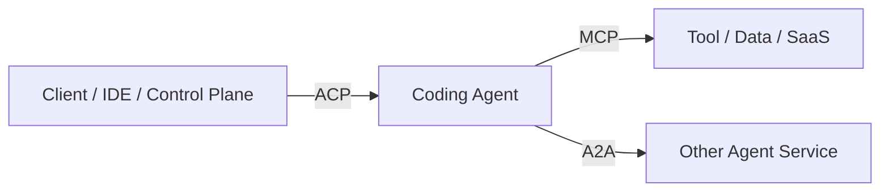

# ACP、A2A 与 MCP 协议选型

> 结论：ACP 不能完整替代 A2A。ACP 更适合 Client-to-Agent，尤其是 IDE、CLI、云端控制面对 coding agent 的会话控制；A2A 更适合 Agent-to-Agent 的跨系统互操作；MCP 是 Agent-to-Tool 的工具接入协议。

## 三类协议的边界

| 协议 | 核心关系 | 主要对象 | 典型用途 |
| --- | --- | --- | --- |
| ACP | Client-to-Agent | 编辑器、CLI、云端控制面、coding agent | 创建会话、发送 prompt、流式事件、权限请求、文件上下文 |
| A2A | Agent-to-Agent | 独立 Agent 服务、外部 Agent、跨团队系统 | Agent 能力发现、任务委派、artifact/status 交换 |
| MCP | Agent-to-Tool | Agent、工具服务器、数据连接器 | 暴露工具、资源、prompt、数据库、SaaS API |

可以把它们理解为三条不同边：



## ACP 适合什么

Agent Client Protocol 的官方定位是让用户主要在编辑器中，通过本地 stdio 或远程 HTTP/WebSocket 与 Agent 通信。它的协议模型基于 JSON-RPC request/response 和 notification。

对本项目而言，ACP 很适合作为内部 coding worker 控制协议：

- 创建或恢复 Agent session。
- 向某个 workspace 发送 prompt。
- 接收 token、工具调用、权限请求、状态变更等事件。
- 做客户端断线重连。
- 让云端 Run Manager 像 IDE 一样控制 Qwen Code、Gemini CLI 或其他 coding agent。

Qwen Code 的 `qwen serve` 已经走了类似路线：一个 daemon 绑定一个 workspace，通过 HTTP + SSE 暴露 session、prompt、events 和 permission mediation，并在内部桥接 ACP child process。

## A2A 适合什么

A2A 的核心是让独立、可能黑盒、可能由不同团队或供应商实现的 Agent 应用互操作。它更关注：

- Agent Card 或能力发现。
- 任务创建和状态管理。
- streaming、push notification、artifact 交换。
- 跨框架、跨语言、跨供应商协同。

因此，当系统未来需要对外接入其他 Agent 平台，或者把自己的 Agent 暴露给外部调用时，A2A 比 ACP 更合适。

## ACP 能否替代 A2A

分场景回答：

| 场景 | ACP 是否足够 | 建议 |
| --- | --- | --- |
| Web 控制台调用内部 Qwen Code worker | 足够 | 用 ACP/ACP-like session protocol |
| Run Manager 控制多个 coding worker | 基本足够 | ACP + 内部事件模型 |
| Supervisor 把任务派给自己的 subagent | 足够起步 | 任务语义由内部 run/step 建模 |
| 对接外部团队的独立 Agent | 不足 | 使用 A2A |
| 做 Agent marketplace 或 federated agents | 不足 | A2A Gateway |
| 工具和数据源接入 | 不适合 | 使用 MCP |

所以，ACP 可以替代一部分“内部 A2A”的需求，但不能替代开放式 Agent-to-Agent 协议。

## 推荐协议架构

MVP 阶段：

```text
Client -> REST/SSE -> Run Manager -> ACP-like -> Qwen Code Worker
Qwen Code Worker -> MCP -> Tools
```

演进阶段：

```text
External Agent -> A2A Gateway -> Run Manager -> ACP -> Coding Worker
Coding Worker -> MCP Gateway -> Tools
```

桥接关系：

| A2A 概念 | 内部概念 | ACP/Qwen 侧 |
| --- | --- | --- |
| Agent Card | agent type/capability | worker metadata |
| Task | run | session + prompt |
| Task status | run status | event stream |
| Artifact | artifact | file/diff/report |
| Push notification | webhook/SSE | session events |
| Input parts | prompt/context | ACP request |

## 为什么不一开始只做 A2A

A2A 解决互操作，但不自动解决：

- sandbox 隔离。
- 工具权限。
- workspace 管理。
- run 恢复。
- token 成本。
- qwen-code/claude-code/opencode 的具体事件适配。

本项目当前真正缺的是 Cloud Agent Runtime。协议应该服务于运行时，而不是反过来让协议决定系统内部结构。

## 协议落地建议

1. 内部先定义稳定的 run event schema。
2. 对 Qwen Code、OpenCode、Gemini CLI 事件做 adapter。
3. 控制 worker 时优先使用 ACP 或 ACP-like session API。
4. 工具统一通过 MCP Gateway 暴露。
5. 需要外部 Agent 互操作时，再做 A2A Gateway。
6. 不要让所有内部状态直接等同于 ACP 或 A2A payload，内部事件模型应当保持自主。

## 参考资料

- [Agent Client Protocol Introduction](https://agentclientprotocol.com/get-started/introduction)
- [Agent Client Protocol Overview](https://agentclientprotocol.com/protocol/v1/overview)
- [A2A Protocol specification](https://github.com/a2aproject/A2A/blob/main/docs/specification.md)
- [A2A Project](https://github.com/a2aproject/A2A)
- [Model Context Protocol](https://modelcontextprotocol.io/)
