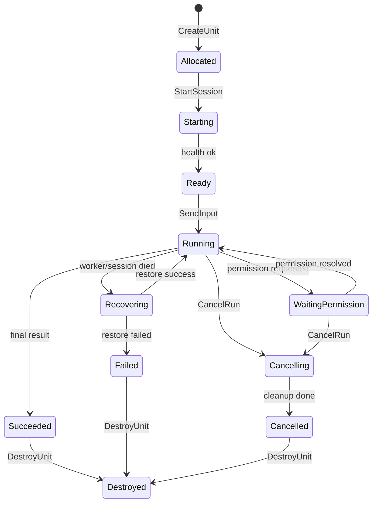

# 稳定单 Agent 执行单元

> 结论：应该把云端 Agent 的基础调度原子抽象成“稳定单 Agent 执行单元”。外部编排系统只依赖这个执行单元的统一契约，而不直接依赖 Qwen Code、Claude Code、OpenCode 或 Gemini CLI 的内部实现。

## 定义

稳定单 Agent 执行单元（Stable Agent Execution Unit，简称 SAEU）是一个可被云端控制面调度、观察、取消、恢复和审计的长期运行 Agent worker。

它不是一个模型调用，也不是一个 CLI 进程，而是以下能力的封装：

- 一个隔离 workspace。
- 一个 Agent runtime。
- 一个受控工具集合。
- 一个事件流。
- 一个权限请求通道。
- 一个 artifact 输出面。
- 一个健康检查和恢复面。
- 一个审计与回放面。

外部多 Agent 编排、任务调度、Kanban 控制面、A2A Gateway、Web UI 都只把 SAEU 当作基础执行单元。

## 为什么需要这个抽象

直接调度 CLI 或容器会把上层系统绑定到具体实现：

- Qwen Code 的 session event 和 OpenCode 的 session event 不同。
- Claude Code 的 tool permission 与 Qwen Code 的 permission mediation 不同。
- Gemini CLI remote subagent 走 A2A，而 qwen serve 走 HTTP + SSE + ACP bridge。
- 某些 worker 支持 resume，某些只支持重新开始。

SAEU 的价值是把这些差异收敛到统一接口：

```text
external orchestrator -> SAEU contract -> concrete agent adapter -> qwen-code serve
```

这样多 Agent 编排调度的是“可靠执行单元”，而不是某个项目的私有 API。

## 边界

SAEU 内部负责：

- 启动 Agent。
- 持有 workspace。
- 接收 prompt/input。
- 输出事件。
- 请求权限。
- 执行取消。
- 产出 artifact。
- 上报健康状态。
- 支持恢复或声明不可恢复。

SAEU 外部负责：

- 租户和用户身份。
- run/thread 业务建模。
- 任务队列和资源调度。
- 跨执行单元编排。
- 全局审计和计费。
- 长期 artifact 归档。
- A2A/MCP 网关。

## SAEU 接口契约

最小控制面接口：

| 接口 | 语义 | 幂等要求 |
| --- | --- | --- |
| `CreateUnit` | 为一个 run 创建执行单元 | `run_id` 幂等 |
| `StartSession` | 启动或附着到 Agent session | `session_key` 幂等 |
| `SendInput` | 向 Agent 发送 prompt 或后续用户输入 | `input_id` 幂等 |
| `StreamEvents` | 订阅执行单元事件 | 支持 `last_event_id` |
| `ResolvePermission` | 对权限请求作出 allow/deny/cancel | `permission_id` 幂等 |
| `CancelRun` | 取消当前 run | 可重复调用 |
| `GetStatus` | 查询 unit/session/run 当前状态 | 只读 |
| `GetDiagnostics` | 查询排障快照 | 只读 |
| `CollectArtifacts` | 收集产物 | 可重复调用 |
| `RestoreUnit` | 从 checkpoint/transcript 恢复 | `run_id` 幂等 |
| `DestroyUnit` | 释放容器、workspace、端口 | 可重复调用 |

最小数据契约：

```json
{
  "unit_id": "unit_run_123",
  "run_id": "run_123",
  "workspace_id": "ws_abc",
  "agent_type": "qwen-code-serve",
  "status": "running",
  "capabilities": {
    "streaming": true,
    "permission_requests": true,
    "resume": true,
    "artifacts": true,
    "diagnostics": true
  }
}
```

## 生命周期状态



状态必须满足：

- 终态只有 `succeeded`、`failed`、`cancelled`、`timed_out`。
- 每次状态变化写入 append-only event。
- 恢复必须记录 `recovering -> running` 或 `recovering -> failed`。
- 外部调度器不得只看进程 PID 判断状态。

## 事件标准

SAEU 输出统一事件，具体 Agent 的事件由 adapter 转换。

| SAEU 事件 | 含义 | Qwen serve 对应 |
| --- | --- | --- |
| `unit.created` | 执行单元创建 | wrapper event |
| `unit.ready` | daemon/session ready | `/health`、`/capabilities`、`POST /session` |
| `run.started` | prompt 被接收 | `POST /session/:id/prompt` 返回 202 |
| `agent.message.delta` | 模型流式文本 | `session_update` chunk |
| `tool.call.started` | 工具调用开始 | `session_update` tool call |
| `tool.call.output` | 工具输出增量 | `session_update` tool output |
| `tool.call.completed` | 工具调用完成 | `session_update` tool result |
| `permission.requested` | 权限请求 | `permission_request` |
| `permission.resolved` | 权限完成 | `permission_resolved` |
| `permission.partial_vote` | 多客户端投票进展 | `permission_partial_vote` |
| `run.heartbeat` | 活性心跳 | SSE heartbeat + wrapper heartbeat |
| `run.completed` | turn/run 成功 | `turn_complete` 或 adapter 判定 |
| `run.failed` | turn/run 失败 | `turn_error`、`session_died` |
| `unit.diagnostics` | 排障快照 | `/daemon/status`、`/session/:id/status` |
| `artifact.created` | 产物落盘 | wrapper artifact collector |

内部事件应当带上：

- `event_id`：执行单元内单调递增。
- `run_id`。
- `unit_id`。
- `source`：`qwen_sse`、`supervisor`、`model_proxy`、`artifact_collector` 等。
- `occurred_at`。
- `payload_ref`：大对象引用。
- `correlation_id`：关联 prompt、tool call 或 permission。

## 权限请求

权限请求必须是一等能力。SAEU 的权限事件需要包含：

```json
{
  "permission_id": "perm_123",
  "run_id": "run_123",
  "tool_call_id": "tool_456",
  "tool_name": "run_shell_command",
  "risk": "high",
  "options": [
    {"id": "allow_once", "label": "Allow once"},
    {"id": "deny", "label": "Deny"}
  ],
  "timeout_at": "2026-06-30T12:10:00Z"
}
```

策略：

- 所有 permission request 必须进入 event store。
- `ResolvePermission` 必须幂等。
- 超时视为 cancel 或 deny，不能无限挂起。
- 多客户端审批要记录投票人和策略。
- 权限请求与工具调用必须能互相关联。

Qwen serve 已经具备 `first-responder`、`designated`、`consensus`、`local-only` 等 permission mediation 策略，适合直接映射到 SAEU 的权限面。

## 健康检查

SAEU 至少提供四级健康：

| 层级 | 检查 | 失败处理 |
| --- | --- | --- |
| Process | qwen serve 进程是否存在 | supervisor 重启或标记 failed |
| HTTP | `/health` 是否 ok | 重试、重启 |
| Runtime | `/daemon/status` 是否可读 | 降级为 degraded |
| Session | `/session/:id/status`、SSE heartbeat | 尝试 resume/load |

健康状态：

- `healthy`：可接收输入。
- `degraded`：仍可读状态，但不建议接新任务。
- `recovering`：正在恢复。
- `unhealthy`：不可用，需要重建或失败转移。

## 可恢复性

SAEU 的恢复能力分为三档：

| 等级 | 能力 | 要求 |
| --- | --- | --- |
| R0 | 不恢复，只保留审计 | 事件和 artifact 完整 |
| R1 | session 恢复 | Agent transcript/session 可 load/resume |
| R2 | run 级恢复 | workspace、transcript、权限、tool 状态都可恢复 |

基于 qwen serve 的第一版目标是 R1+：

- 使用 `/session/:id/load` 或 `/session/:id/resume` 恢复 session。
- 用外部 Event Store 补足 qwen serve event ring 的持久性。
- 对工具和权限事件做外部幂等记录。
- workspace 用 git commit/worktree snapshot 保证现场可恢复。

## 与 A2A/ACP 的关系

SAEU 是内部抽象，不等同于 ACP 或 A2A。

| 层 | 协议建议 |
| --- | --- |
| Run Manager -> qwen serve SAEU | qwen serve HTTP/SSE + ACP bridge |
| 外部 Agent -> 本系统 | A2A Gateway |
| Agent -> 工具 | MCP Gateway |
| UI/CLI -> Run Manager | REST/SSE/WebSocket |

A2A 可以表达 Agent Card、task、status、artifact、streaming 和 push notification；但 coding agent 的权限请求、workspace 诊断、tool stdout、session resume 等细节需要用扩展 metadata 或由内部 SAEU contract 承担。

## 验收标准

一个 SAEU 合格的最低标准：

- 能用统一接口创建、启动、输入、订阅、取消、销毁。
- 所有状态变化和权限请求都有事件。
- 客户端断线后能用 `last_event_id` 追事件。
- qwen serve event ring 丢失窗口时，外部 Event Store 仍有完整事件。
- 权限请求能被审批、拒绝、超时和审计。
- 每次运行都有 transcript、events、diff、final report 和 diagnostics。
- 进程崩溃后能判断是否恢复、重试或终止。
- 不把模型 key、SSH key、Docker socket 暴露给 Agent 容器。

## 决策

后续多 Agent 编排应当只调度 SAEU，而不是直接调度“某个 qwen serve 进程”。第一版 SAEU adapter 可以由 Qwen Code 实现，后续可接入 Claude Code、OpenCode、Gemini CLI 或自研 worker。
