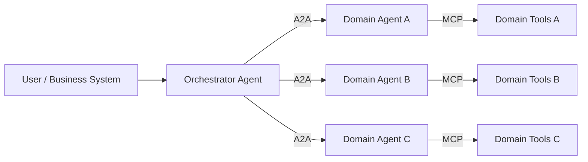
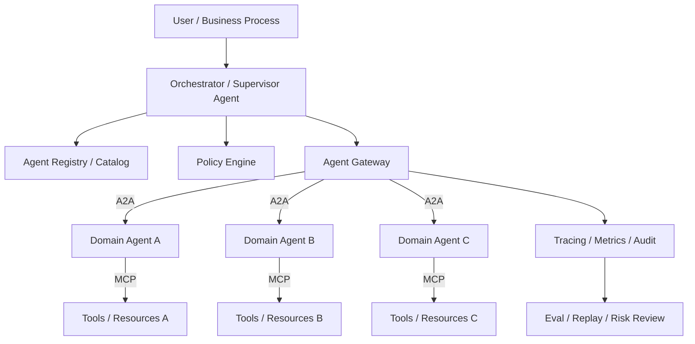
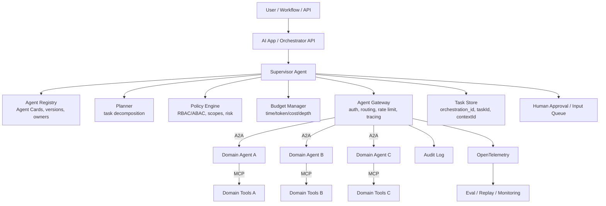

# A2A 协议生态与多 Agent 编排治理调研

> 更新日期：2026-07-15。本文聚焦 A2A 协议生态、生产成熟度、企业级多 Agent 编排治理与风险控制；不讨论特定业务 Agent 或本地工具链落地。

## 执行摘要

A2A（Agent2Agent）已经从 2025 年 Google 发起的 Agent 互操作协议，演进为 Linux Foundation 下的开放标准，并在 2026 年进入 v1.0 生产就绪阶段。公开生态信号包括：A2A GitHub 主仓显示 `v1.0.1` 为最新 release，Linux Foundation 公告称 A2A v1.0 是首个稳定规范并引入多协议支持、多租户、安全流和迁移路径，Google 最初发布时强调 A2A 用于跨平台 Agent 安全通信、能力发现和长任务协作。

但 A2A 不是多 Agent 编排器。它解决的是“Agent 之间如何发现、通信、交付任务和结果”的协议层问题；它不负责全局规划、任务拆解、预算控制、权限审批、策略执行、Agent 质量评估、冲突仲裁、循环防护、成本治理或组织级审计。这些能力必须由 Orchestrator、Agent Gateway、Registry、Policy Engine、Observability/Eval 平台共同承担。

对企业级多 Agent 系统而言，A2A 的价值不在于让所有 Agent 彼此自由聊天，而在于把跨团队、跨框架、跨云、跨组织的 Agent 调用标准化，然后在这个标准边界上做治理。推荐分工是：**A2A 做 Agent-to-Agent 互操作协议，MCP 做 Agent-to-Tool/Resource 接口，Agent Gateway 做运行时治理，Registry 做发现与准入，Orchestrator 做任务规划和控制面，Observability/Eval 做闭环验证。**

## 1. 协议定位

A2A 的官方定位是 Agent-to-Agent 通信协议，面向“独立、可能不透明的 Agentic Applications”。核心目标是让不同框架、不同厂商、不同运行环境里的 Agent 能发现彼此、交换消息、委托任务、跟踪长任务，并在不暴露内部工具、记忆、Prompt 或实现细节的情况下协作。

它明确不是：

- Agent 开发框架；
- Sub-agent 内部编排 DSL；
- Tool-call 协议；
- MCP 的替代品；
- 即时通讯应用；
- 工作流引擎或任务队列。

这点非常重要。A2A 是“边界协议”，不是“智能体大脑”。它适合规范跨系统协作边界，不适合替代业务编排、权限系统、预算系统和运行时治理。

## 2. 版本与成熟度

截至 2026-07-15 的公开资料：

- A2A GitHub 主仓描述其为开放协议，用于“opaque agentic applications”之间的通信和互操作，最新 release 显示为 `v1.0.1`，发布时间为 2026-05-28。
- Linux Foundation 公告称 A2A v1.0 是第一个稳定规范，加入多协议支持、企业级多租户、现代化安全流、Signed Agent Cards 和迁移路径。
- Google 发布 A2A 时强调其构建在 HTTP、SSE、JSON-RPC 等既有标准之上，支持能力发现、任务管理、长任务状态更新、多模态消息 Part 和企业级认证授权。

这说明 A2A 已经跨过“只有 paper/spec，没有实现”的阶段，但还没有达到 Kubernetes、OpenAPI、OpenTelemetry 那种成熟生态状态。更准确的判断是：A2A 处在从 early adopter 向企业标准化过渡的阶段，规范、SDK、TCK、Inspector、云平台托管和网关生态正在形成，最佳实践仍在快速收敛。

## 3. 核心协议能力

A2A 的关键对象和能力包括：

| 能力 | 说明 | 编排价值 |
| --- | --- | --- |
| Agent Card | JSON 元数据，描述 Agent 身份、endpoint、能力、认证方案、skills、输入输出模态 | 发现、准入、能力匹配、治理 |
| AgentSkill | Agent Card 中的能力单元，包含 id/name/description/inputModes/outputModes/examples | 路由、授权、选择 Agent |
| Message / Part | 多模态消息；Part 可包含 text、file、data、media 等 | 跨 Agent 标准输入输出 |
| Task | 有生命周期的工作单元 | 长任务追踪、取消、恢复、审计 |
| Artifact | 任务产物，支持文本、文件、结构化数据等 | 结果治理、产物追溯 |
| contextId | 跨 task/message 的上下文分组 | 多轮上下文、会话连续性 |
| taskId | 单个任务的唯一标识 | 状态机、幂等、取消、查询 |
| Streaming | SSE 等实时更新 | 进度可视化、实时协作 |
| Push notification | Webhook 异步通知 | 长任务、离线集成、事件驱动 |
| Auth/Security | OAuth2/OIDC/API Key/mTLS 等 Web 标准 | 企业身份、授权、审计 |
| Multi-tenancy | URL、auth header、tenant 字段等路由模式 | 共享 endpoint 下的多 Agent/多租户隔离 |

Task 状态机是多 Agent 编排的基础。A2A TaskState 包含 submitted、working、completed、failed、canceled、input-required、rejected、auth-required 等状态，为编排器提供了可观测和可控制的任务生命周期。

## 4. 与 MCP 的关系

A2A 和 MCP 的分工应保持清晰：

- MCP：Agent-to-Tool/Resource。一个 Agent 如何读取数据库、调用 API、访问文件、使用内部工具。
- A2A：Agent-to-Agent。一个 Agent 如何把任务委托给另一个独立 Agent，并接收状态、消息和产物。

实际系统中通常组合使用：

不建议把所有工具都包装成 A2A Agent。只有具备独立 reasoning、规划、状态、领域责任和黑盒服务边界的系统，才值得暴露为 A2A Agent。细粒度 API、数据库、文件系统和内部工具仍更适合 MCP 或普通服务 API。

## 5. 生态构成

### 5.1 标准与治理生态

A2A 由 Linux Foundation 托管，降低了单一厂商锁定风险，也让它更容易成为企业间互操作标准。Linux Foundation 公告提到 A2A 已有超过 150 家组织支持，并称在供应链、金融服务、保险、IT operations 等行业出现生产部署。

需要保守理解的是：“150+ 组织支持”不等于“150+ 大规模生产部署”。公开资料里大量是支持、集成、伙伴和平台路线声明，而不是完整的生产事故、性能、治理和成本案例。生态势能明确，但生产经验仍在沉淀中。

### 5.2 SDK 与样例

官方生态已经覆盖多语言 SDK 与样例。SDK 的价值不只是“少写 HTTP 请求”，而是帮助各团队在 Agent Card、Task、Artifact、Streaming、Auth、Task Store、Client Wrapper、Protocol Binding 等细节上保持兼容。

样例仓库对学习和跨语言互操作有价值，但不能等同生产质量。外部 Agent 的 Agent Card、message、artifact、task status 都应当作为不可信输入处理。A2A 让 Agent 更容易互联，也让 prompt injection、数据投毒、能力伪装、artifact 污染更容易跨边界传播。

### 5.3 TCK 与 Inspector

A2A 生态已经出现两类质量工具：

- TCK：Technology Compatibility Kit，用于验证实现是否符合 A2A 要求。
- Inspector：Web 调试与验证工具，可读取 Agent Card、发送消息、检查 raw protocol message。

这两个工具是 A2A 进入企业生产的必要条件，因为没有一致性测试就没有真正互操作。不过 TCK 只能证明“会说 A2A”，不能证明业务正确、权限正确或结果可信。企业仍需要业务场景 eval、回归集、shadow/canary 和人工复核。

### 5.4 云平台生态

Google 是 A2A 最初发起方，并将其描述为跨孤立数据系统和应用的动态多 Agent 协作协议。Microsoft 将 A2A 纳入 Azure AI Foundry、Copilot Studio 和 Microsoft Agent Framework 互操作路线。AWS Bedrock AgentCore Runtime 支持部署 A2A server，并通过云运行时提供身份、隔离、伸缩和代理能力。

这些信号说明 A2A 不只是单一云厂商内部协议，而正在被多个企业 AI 平台吸收为互操作层。云平台的角色也不是替 A2A 完成所有编排，而是把 A2A server 作为可托管 runtime，对外保持协议兼容，对内提供身份、伸缩、隔离、监控和运维。

### 5.5 Agent Gateway 与运行时治理生态

Agentgateway 是 A2A 生产化的重要周边项目，定位为 AI-native proxy / data plane，用于治理 Agent-to-Agent、Agent-to-Tool、Agent-to-LLM 通信。其官方页面强调在一个 data plane 中处理服务、LLM、MCP 和 Agent-to-Agent 通信，并提供路由、安全、观测和治理。

这补上了 A2A 本身不做的运行时治理层：

- 认证、授权、RBAC/ABAC；
- rate limit、timeout、retry、traffic policy；
- request/response/header transformation；
- tracing、metrics、audit；
- 多后端路由；
- 对 MCP/A2A/LLM traffic 的统一控制面。

在企业多 Agent 系统中，A2A server 直接互调是危险的。更合理的是所有跨边界调用都经过 gateway，让策略、审计、限流、隔离、告警、kill switch 有统一入口。

## 6. 当前使用现状判断

| 层级 | 现状 | 成熟度 |
| --- | --- | --- |
| 规范 | v1.0 稳定版已发布，v1.0.1 release 出现 | 中高 |
| SDK | 多语言官方 SDK 和样例 | 中 |
| 工具 | TCK、Inspector、samples、迁移文档 | 中，仍快速迭代 |
| 生产 | 云平台托管/集成，LF 宣称多行业生产使用 | 中，公开细节有限 |

A2A 已适合：

- 跨框架 Agent 互调，例如 LangGraph、Semantic Kernel、ADK、自研 Agent 混合；
- 跨团队领域 Agent 协作；
- 跨云或跨组织 Agent 互操作；
- 长任务、异步任务、需要 streaming 或 push 的任务；
- 需要保留 remote Agent 黑盒边界的协作；
- 企业内部 Agent catalog / marketplace 的标准入口；
- 将已有 domain expert Agent 暴露给其他系统调用。

暂不建议强行使用 A2A 的场景：

- 单一应用内部 sub-agent 调度；
- 简单工具/API 调用；
- 高频、低延迟微操作；
- 未建立身份、授权、审计、网关的开放 Agent mesh；
- 只靠自然语言 Artifact 完成强一致事务或严格形式化验证；
- 无法把外部 Agent 视为不可信输入的系统。

## 7. 现实瓶颈

### 7.1 语义互操作难

Agent Card 说明“能做什么”，但自然语言 skill description 仍可能模糊。一个 Agent 的 `invoice_reconciliation` 与另一个 Agent 的同名能力是否语义一致，需要 schema、ontology、examples、contract tests 和 eval 支撑。

### 7.2 可信发现难

`/.well-known/agent-card.json` 易实现，但企业更需要 curated registry、签名卡片、认证 extended card、差异化能力披露、版本审计、owner 和下线机制。

### 7.3 权限传递难

一个 Agent 调另一个 Agent 时，到底代表最终用户、调用方 Agent、业务应用，还是服务账号？Scope 如何递减？下游是否允许继续委托？这是生产落地的核心难点。

### 7.4 长任务治理难

Streaming、polling、push 都有协议机制，但任务超时、取消、补偿、重试、去重、恢复、死信队列仍是平台责任。

### 7.5 安全边界复杂

Agent Card、message、artifact、file URL 都可能成为攻击载体。跨 Agent 场景下，prompt injection 和数据泄漏会沿着 Agent 链路传播。

### 7.6 评测与可观测性不足

TCK 验证协议合规，不验证 Agent 是否做对业务。企业仍需场景 eval、回归集、shadow/canary、人工复核、审计和 replay。

## 8. 多 Agent 编排中的管控模型

### 8.1 协议层、编排层、治理层

多 Agent 系统至少分三层：

- 协议层：A2A/MCP/HTTP，解决通信格式。
- 编排层：谁调用谁、怎么拆任务、怎么合并结果、何时停止。
- 治理层：谁被允许调用、能看什么数据、花多少钱、出错怎么办、如何审计。

A2A 只覆盖协议层的一部分。多 Agent 可控的关键在编排层和治理层。

### 8.2 编排拓扑

#### Hub-and-Spoke / Supervisor

一个主 orchestrator 负责规划、选择 Agent、调度任务、聚合结果。

优点是最容易治理、容易做全局预算、审计和人工审批，也能避免 Agent 之间无限递归。缺点是 orchestrator 成为瓶颈，需要较强规划和任务理解能力。企业生产建议优先采用该模式。

#### Hierarchical

总 orchestrator 管多个 domain supervisor，每个 supervisor 再管理多个 specialist Agent。

优点是适合大型组织和复杂领域，可以按业务域设置权限和 owner。缺点是上下文传递更复杂，审计链路更长。

#### Peer-to-Peer

Agent 之间直接互相调用。

优点是灵活，适合少量跨组织协作。缺点是最难治理，容易循环、权限扩散、成本失控和不可追踪。除非有强 gateway 和策略系统，不建议作为企业默认模式。

#### Blackboard / Shared Workspace

多个 Agent 读写同一个任务状态或共享 workspace，由 orchestrator 或规则引擎推进。

优点是适合复杂协同和异步工作，易于人工介入和 replay。缺点是共享状态需要强权限、版本控制和冲突解决。

### 8.3 Agent 准入与发现

企业场景应优先 curated registry，而不是让 orchestrator 随机读取互联网上的 Agent Card。

Registry 至少需要记录：

- Agent Card 原文与签名；
- owner、团队、版本、endpoint、认证方案；
- SLA、成本等级、风险等级；
- skills 的业务 taxonomy；
- TCK 结果、场景 eval 结果、安全审查状态；
- public card 与 authenticated extended card 的差异；
- 下线、回滚、冻结和 kill switch 状态。

Agent Card 是能力声明，不是可信证明。准入流程至少要检查：

- endpoint 是否在允许域名/网络；
- securitySchemes 是否满足企业要求；
- skills 是否过宽或描述模糊；
- 是否包含内部 URL、密钥、敏感路径；
- examples 是否可能 prompt injection；
- outputModes 是否含高风险 file/url；
- 是否通过 TCK must-level 测试；
- 是否有 owner、SLA、版本和退场机制。

### 8.4 身份、授权与委托控制

每次 A2A 调用都应明确三类身份：

- End user identity：最终用户是谁；
- Calling agent identity：哪个 Agent 发起调用；
- Client application identity：哪个应用或业务流程承载调用。

主身份应在 transport/header/token claims 中表达，A2A payload 不应成为唯一身份来源。

授权原则：

- skill-level authorization：调用方是否能调用某个 skill；
- data-level authorization：能访问哪个租户、项目、workspace、表、字段、文档；
- action-level authorization：能否执行写入、删除、发送邮件、下单等动作；
- delegation authorization：被调用 Agent 是否可以继续调用第三方 Agent；
- scope attenuation：下游权限不得超过上游用户或调用方权限；
- in-task authorization：遇到高风险动作转 `auth-required` 或 `input-required`，交给用户或审批系统。

策略实现可以采用 gateway RBAC/ABAC、OPA/Rego、Cedar、企业 IAM policy、OAuth scopes、tenant/workspace membership、per-skill allowlist 和 risk-based approval policy。

### 8.5 任务生命周期管控

A2A 的 `taskId` / `contextId` 是多 Agent 编排可控的核心。编排器应维护全局任务表：

| 字段 | 说明 |
| --- | --- |
| orchestration_id | 一次用户目标或业务流程的全局 ID |
| parent_task_id | 上游任务 |
| a2a_task_id | 被调 A2A Agent 返回的 taskId |
| context_id | A2A contextId |
| agent_id | 被调用 Agent |
| skill_id | 调用 skill |
| user_id / tenant_id | 身份与租户 |
| state | submitted/working/input-required/auth-required/completed/failed/canceled |
| budget | token/time/cost/step 限额 |
| deadline | 超时时间 |
| approval_state | 人工审批状态 |
| trace_id | OpenTelemetry trace |
| artifact_refs | 产物引用 |

必须实现：

- idempotency key，避免重试重复创建任务；
- timeout 和 deadline；
- cancel cascade，用户取消后递归取消子任务；
- max depth / max fan-out；
- retry policy，只对幂等或可补偿任务重试；
- dead-letter / manual review；
- task state reconciliation，避免 streaming/polling/push 状态冲突；
- terminal state 不回退；
- input-required 和 auth-required 的统一用户交互队列。

### 8.6 预算与资源控制

多 Agent 系统会天然放大成本。一个用户问题可能触发几十个 Agent 和数百个工具调用。

建议设置四类预算：

- time budget：全局 deadline、单 Agent timeout、stream idle timeout；
- token budget：输入、输出、上下文摘要长度；
- cost budget：模型费用、工具费用、外部 API 费用；
- action budget：最大 Agent 调用数、最大工具调用数、最大委托深度。

管控策略：

- 每个 Agent Card/Skill 标注预估成本等级；
- orchestrator 调度前做预算预检查；
- 每个 task 执行中持续累计；
- 超预算进入 `input-required` 请求用户确认，或直接降级/取消；
- 对高成本 Agent 做并发限流和队列；
- 记录每个 Agent 的 cost attribution。

### 8.7 安全与风险控制

主要风险：

- Agent Card prompt injection：恶意 description/example 诱导 orchestrator 泄密或越权。
- Artifact injection：下游 Agent 返回的文本/HTML/JSON 被上游 Agent 当成指令执行。
- URL/file SSRF：artifact 中的 URL 指向内网或恶意资源。
- Capability spoofing：Agent 声称具备某能力，但实际不可靠或过度授权。
- Delegation loop：Agent A 调 B，B 调 C，C 又调 A。
- Data exfiltration：Agent 通过另一个 Agent 把数据带出权限边界。
- Confused deputy：下游 Agent 利用上游高权限执行动作。
- Approval laundering：低风险任务中嵌入高风险动作，绕过人工审批。
- Multi-tenant leakage：task list/get/subscribe 没有按 authenticated caller scope。

防护清单：

- 所有外部 Agent 输入都标记为 untrusted；
- Agent Card 只进入 registry，不直接进入 prompt；
- 对 description/examples 做安全清洗和长度限制；
- Artifact 使用 schema 校验、MIME 校验、URL allowlist；
- 禁止下游 Agent 直接给上游 Agent 注入 system/developer 指令；
- 每次 delegation 带上 policy context 和 trace context；
- 默认禁止 recursive delegation，除非显式授权；
- 高风险动作必须 human approval；
- 所有 task/list/get/cancel/subscribe 都按 caller scope 检查；
- 文件和 URL 获取通过安全代理；
- 对 sensitive data 做 DLP/redaction；
- 对每个 Agent 配置 kill switch。

### 8.8 可观测性与审计

生产编排必须做到：

- 每个 orchestration 一个 trace；
- 每次 A2A call 一个 span；
- trace attributes 包含 agent_id、skill_id、task_id、context_id、tenant_id、risk_level、cost；
- 记录 request/response 摘要，敏感字段脱敏；
- streaming event 采样或聚合；
- artifact 记录 hash、schema、owner、retention；
- 审计关键事件：task created、delegated、input-required、auth-required、approval granted/denied、cancel、failed、completed；
- 建立 replay 能力，用于事故复盘和评测回归。

核心指标：

- task success rate；
- task timeout/cancel/retry rate；
- input-required rate；
- auth-required rate；
- agent latency p50/p95/p99；
- artifact validation failure；
- policy deny count；
- cost per orchestration；
- delegation fan-out/depth；
- human approval turnaround；
- hallucination/incorrect answer eval score。

### 8.9 质量评估与持续治理

企业需要三类 eval：

1. Protocol conformance  
   使用 TCK、Inspector、schema snapshot，保证会说 A2A。

2. Behavior eval  
   针对 Agent Skill 的场景测试：是否正确理解任务、是否调用正确工具、是否按权限返回、是否在不确定时提问。

3. Orchestration eval  
   验证多 Agent 链路：任务拆解是否合理、是否过度委托、是否合并冲突、是否超预算、是否正确处理失败。

建议把每个 Agent Card 的版本与 eval 报告绑定。Registry 只允许通过最低 eval 门槛的 Agent 被生产 orchestrator 调用。

## 9. 推荐参考架构

| 组件 | 责任 |
| --- | --- |
| Supervisor Agent | 规划、分派、聚合、终止条件 |
| Agent Registry | Agent Card、版本、owner、SLA、风险等级、eval 状态 |
| Policy Engine | 授权、数据范围、动作审批、委托深度 |
| Budget Manager | token/time/cost/step/fan-out 控制 |
| Agent Gateway | 统一入口、认证、限流、路由、trace、审计、kill switch |
| Task Store | 全局 task/context 映射和状态机 |
| Human Approval Queue | input-required/auth-required/高风险动作审批 |
| Eval Platform | 协议合规、业务正确性、编排质量回归 |

## 10. 落地路线建议

### 阶段 0：标准边界定义

- 定义哪些系统值得暴露为 A2A Agent，哪些只是工具/API。
- 定义企业 Agent Card baseline schema。
- 定义 skill taxonomy、artifact taxonomy、error taxonomy。
- 明确 Agent 身份、用户身份、应用身份的 token/claim 模型。
- 建立 A2A contract tests 和 schema snapshot。

### 阶段 1：A2A Server / Client PoC

- 发布 internal Agent Card。
- 支持 message/send、message/stream、tasks/get、tasks/cancel。
- 支持 contextId/taskId 的持久化映射。
- 对 input-required/auth-required 建立统一交互队列。
- 接入 OpenTelemetry trace。
- 只允许内部 allowlist 调用方。

### 阶段 2：企业治理

- 接入 Agent Registry。
- 接入 Agent Gateway。
- 加 OAuth/OIDC、mTLS 或内部 STS token exchange。
- 加 skill-level、data-level、action-level authorization。
- 加 cost/time/depth/fan-out budget。
- 加 human approval queue。
- 接入 TCK、Inspector、CI。

### 阶段 3：生产化与生态接入

- 支持 signed Agent Card 和 authenticated extended card。
- 支持 curated registry selective disclosure。
- 支持 push notification，并完成 webhook 安全设计。
- 引入场景 eval、canary、shadow、replay。
- 建立事故复盘、版本回滚和 kill switch 机制。
- 与企业 Agent marketplace 或跨组织 Agent endpoint 对接。

## 11. 风险清单

| 风险 | 影响 | 缓解 |
| --- | --- | --- |
| Agent Card 伪造/投毒 | 错误路由、prompt injection | 签名、registry 审核、输入清洗 |
| 权限扩散 | 数据泄漏、越权动作 | scope attenuation、policy engine、gateway |
| 循环委托 | 成本和延迟失控 | max depth、visited agent set、orchestration budget |
| 长任务悬挂 | 资源泄漏、用户体验差 | deadline、cancel cascade、dead letter |
| 产物污染 | 上游 Agent 被注入 | artifact schema、MIME/URL 校验、untrusted 标记 |
| 观测不足 | 无法复盘事故 | OTel、audit log、task store |
| 协议合规但业务错误 | 用户得到错误结论 | scenario eval、human review、confidence gating |
| 多租户串线 | 严重安全事故 | 每个 operation scope check、tenant isolation |
| push webhook SSRF | 内网探测/攻击 | webhook allowlist、签名、回调认证、egress policy |
| 版本漂移 | 互操作失败 | TCK、SDK pinning、Agent Card versioning |

## 12. 总结判断

A2A 的生态已经具备进入企业视野的条件：Linux Foundation 治理、v1.0 稳定规范、多语言 SDK、TCK/Inspector、主流云平台支持、Agentgateway 这类治理基础设施，以及超过 150 家组织支持的公开信号。

但它的生产价值不在“让 Agent 自由互聊”，而在“让 Agent 协作变成可发现、可授权、可追踪、可取消、可评测、可治理的标准服务调用”。未来多 Agent 系统的胜负手，不是能不能发 A2A message，而是有没有完整控制面。

最稳的架构判断是：

- MCP 继续做 Agent 到工具/资源；
- A2A 做 Agent 到 Agent；
- Agentgateway / API gateway 做运行时治理；
- Registry 做发现、准入、版本和能力治理；
- Orchestrator 做任务拆解、合并、预算和终止；
- Eval/Observability 做持续质量闭环。

## 参考来源

- [A2A Protocol Home](https://a2a-protocol.org/latest/)
- [A2A Protocol Specification](https://a2a-protocol.org/latest/specification/)
- [A2A Core Concepts](https://a2a-protocol.org/latest/topics/key-concepts/)
- [A2A Agent Discovery](https://a2a-protocol.org/latest/topics/agent-discovery/)
- [A2A Enterprise Features](https://a2a-protocol.org/latest/topics/enterprise-ready/)
- [A2A Multi-Tenancy](https://a2a-protocol.org/latest/topics/multi-tenancy/)
- [A2A Roadmap](https://a2a-protocol.org/latest/roadmap/)
- [A2A SDKs](https://a2a-protocol.org/latest/sdk/)
- [A2A GitHub](https://github.com/a2aproject/A2A)
- [A2A Samples](https://github.com/a2aproject/a2a-samples)
- [A2A TCK](https://github.com/a2aproject/a2a-tck)
- [A2A Inspector](https://github.com/a2aproject/a2a-inspector)
- [Linux Foundation A2A adoption announcement](https://www.linuxfoundation.org/press/a2a-protocol-surpasses-150-organizations-lands-in-major-cloud-platforms-and-sees-enterprise-production-use-in-first-year)
- [Google A2A announcement](https://developers.googleblog.com/en/a2a-a-new-era-of-agent-interoperability/)
- [Microsoft A2A integration](https://learn.microsoft.com/en-us/agent-framework/integrations/a2a)
- [Microsoft A2A cloud blog](https://www.microsoft.com/en-us/microsoft-cloud/blog/2025/05/07/empowering-multi-agent-apps-with-the-open-agent2agent-a2a-protocol/)
- [AWS Bedrock AgentCore A2A docs](https://docs.aws.amazon.com/bedrock-agentcore/latest/devguide/runtime-a2a.html)
- [Agentgateway docs](https://agentgateway.dev/)
